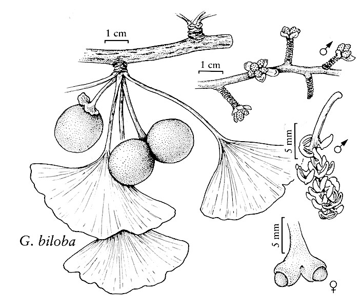
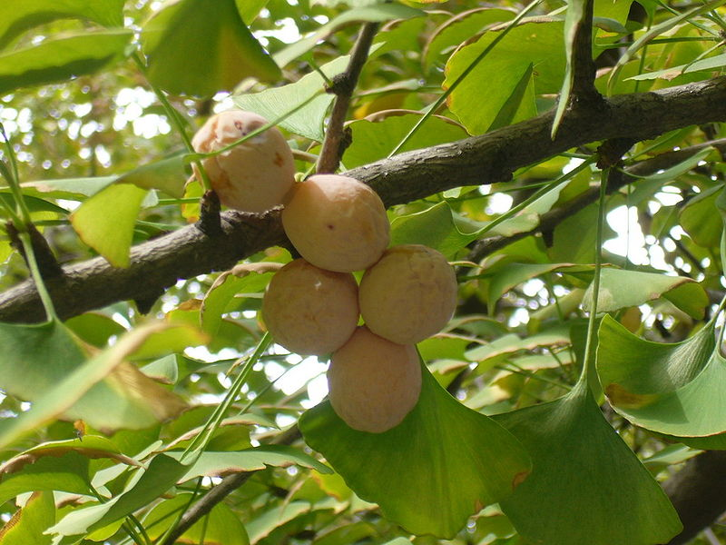
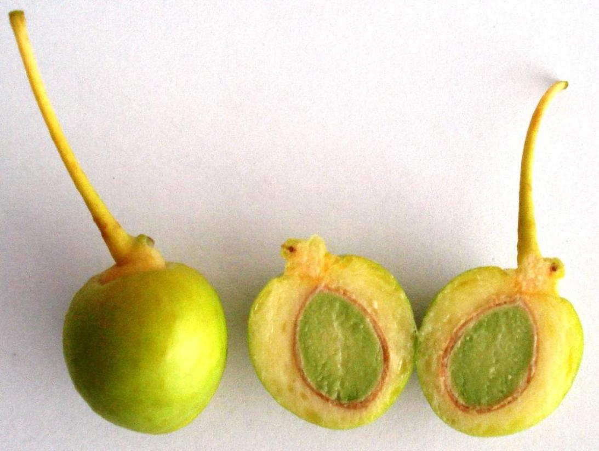
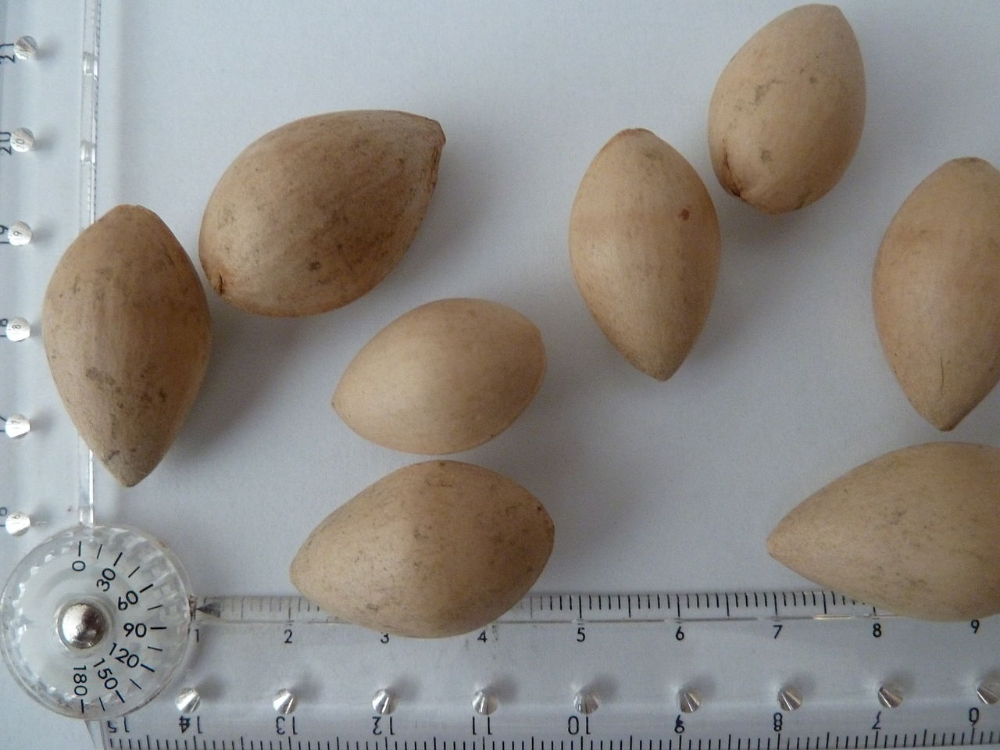

<!-- Generated by fetch-wordpress.py from https://pedrojordano.wordpress.com/2016/12/31/ginkgo/ — do not edit by hand. -->

```{=html}
<p>Ginkgoes and dodos are my two favorite icons of “ghost” mutualistic interactions. So, I had the two last posts on megafauna and extinct interactions dedicated to them.</p>
<p>There are only five living groups of seed plants, and ginkgo is one of them; just a single species. Ginkgoes (<em>Ginkgo biloba</em>, Ginkgoaceae) have fleshy “fruits” and their “seeds” were dispersed by animals including, most probably, from dinosaurs to Pleistocene megafauna, and to extant frugivores nowadays. The reason is that the ginkgo has survived on Earth for a really extended period of time, with the earliest fossils of ginkgo-like plants dated more than 200 million years ago. Among the many ginkgo-like tree species, only <em>Ginkgo biloba</em> has survived <span class="s1" style="line-height:1.7;">(up to five Ginkgo species are known as fossils)</span><span style="line-height:1.7;">.</span></p>
<p></p>
<p>Living ginkgo very nearly went extinct, in fact, as of two million years ago, existing in only a small area in eastern China, the Tian Mu Shan mountains in Guizhou Province. Ginkgoes have then survived just by human intervention, with an assisted dissemination for cultivation starting at least 1200 yr ago by Buddhist monks, and introduced to Europe just by 1730-1750.</p>
<p><figure aria-describedby="caption-attachment-766" class="wp-caption aligncenter" data-shortcode="caption" id="attachment_766" style="width: 543px"><figcaption class="wp-caption-text" id="caption-attachment-766">From Engelbert Kaempfer in his Amoenitates, 1712: the first illustration of ginkgo by a Western botanist.</figcaption></figure></p>
<p>Most likely a combination of extreme dispersal limitation due to lack of efficient seed dispersers combined with large-scale climate shifts and habitat modification contributed to their nearly extinction in the wild. Contrary to other tree species, retractions to small refugia populations failed to recover the original range, especially in North America and Europe. As with other megafauna-dependent species, it resprouts vigorously from buds buried in its underground parts, and human use certainly rescued the ginkgoes, probably because of their nutritous “nut”. In Peter Crane’s words: “It is irrepressible; its capacity for self-preservation has helped it survive through millions of generations.”</p>
<p>We know very little about how seed dispersal works in living ginkgo. The fleshy “fruit” is really the mature, fertilized ovule with a a three-layered integument: a fleshy outer sarcotesta, a stony inner sclerotesta, and a thin endotesta. Its smelly, large seeds (20-30 mm x 16-24 mm) are one of its most well-known and distinctive features: the seed’s soft outer layer starts to break down after a few days on the ground and produces butyric acid, CH3(CH2)2COOH giving it the “interesting” odor. Germination improves after the fleshy seed coat has been removed by passing through the gut of an animal or being teared-off. In one of the potentially wild ginkgo populations in China it is documented that the seeds are eaten by a wild cat, and in Japan they are eaten by badgers. Yet, there were very few seedlings in this population, located in 1989 by Del Tredici, despite good fruiting. People harvested the nuts, which are very nutritious, as well as Pallas’s squirrels (<em>Callosciurus erythraeus</em>), which also may act as good dispersers by scatter-hoarding the seeds.</p>
<p><div class="tiled-gallery type-rectangular tiled-gallery-unresized" data-carousel-extra='{"blog_id":14689808,"permalink":"https:\/\/pedrojordano.wordpress.com\/2016\/12\/31\/ginkgo\/","likes_blog_id":14689808}' data-original-width="840" itemscope="" itemtype="http://schema.org/ImageGallery"> <div class="gallery-row" data-original-height="422" data-original-width="840" style="width: 840px; height: 422px;"> <div class="gallery-group images-1" data-original-height="422" data-original-width="561" style="width: 561px; height: 422px;"> <div class="tiled-gallery-item tiled-gallery-item-large" itemprop="associatedMedia" itemscope="" itemtype="http://schema.org/ImageObject"> <a border="0" href="https://pedrojordano.wordpress.com/2016/12/31/ginkgo/800px-ginkgo_biloba_seeds-001/" itemprop="url"> <meta content="557" itemprop="width"/> <meta content="418" itemprop="height"/>  </a> <div class="tiled-gallery-caption" itemprop="caption description"> Ginkgo fruits. </div> </div> </div> <!-- close group --> <div class="gallery-group images-2" data-original-height="422" data-original-width="279" style="width: 279px; height: 422px;"> <div class="tiled-gallery-item tiled-gallery-item-large" itemprop="associatedMedia" itemscope="" itemtype="http://schema.org/ImageObject"> <a border="0" href="https://pedrojordano.wordpress.com/2016/12/31/ginkgo/ginkgo_biloba_-_fruit/" itemprop="url"> <meta content="275" itemprop="width"/> <meta content="208" itemprop="height"/>  </a> <div class="tiled-gallery-caption" itemprop="caption description"> Ginkgo unripe fruits, cross-section. </div> </div> <div class="tiled-gallery-item tiled-gallery-item-large" itemprop="associatedMedia" itemscope="" itemtype="http://schema.org/ImageObject"> <a border="0" href="https://pedrojordano.wordpress.com/2016/12/31/ginkgo/1280px-ovules_de_ginkgo_biloba/" itemprop="url"> <meta content="275" itemprop="width"/> <meta content="206" itemprop="height"/>  </a> <div class="tiled-gallery-caption" itemprop="caption description"> Ginkgo “seeds”. </div> </div> </div> <!-- close group --> </div> <!-- close row --> </div></p>
<p>Yet who were the seed dispersers that mediated the range expansion of ginkgoes over continents and islands (Japan) before human-mediated propagation? As in other megafauna-dependent plants, most likely a combination of dispersal agents, including large and medium-sized mammals and, well before that, dinosaurs. As with other extant large-‘seeded’ Coniferopsida like <em>Cephalotaxus</em> and <em>Torreya</em> with very large seeds, scatter-hoarding animals like the extinct multituberculates (i.e., the ‘rodents’ of the Mesozoic; g. <em>Ptilodus</em>) would have played a role in active seed dispersal of ginkgoes by scatter-hoarding the seeds.</p>
<p>We can see ginkgoes as survivors with a long history of mutualistic interactions involving a diverse array of animals, whose actual diversity we can only speculate about, then replaced by extensive human use.</p>
<ul>
<li>van Beek, T.A. (2003) Ginkgo biloba. CRC Press, NY.</li>
<li>Crane, P. (2013). Ginkgo. The tree that time forgot. Yale University Press, New Haven.</li>
<li>del Tredici, P. (1989) Ginkgos and multituberculates: evolutionary interactions in the Tertiary. Bio Systems, 22, 327–339.</li>
</ul>
<p>Text: Pedro Jordano with excerpts from Del Tredici (1989) and Crane (2013). Illustrations: WikiMedia.</p>

```

::: {.wp-original}
Originally published on [my WordPress blog](https://pedrojordano.wordpress.com/2016/12/31/ginkgo/).
:::
