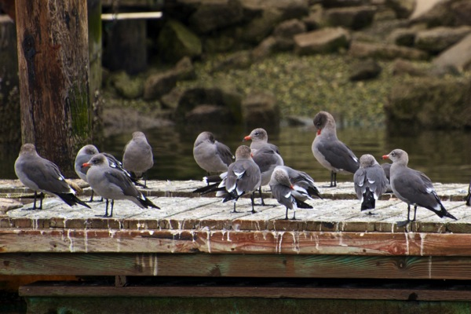
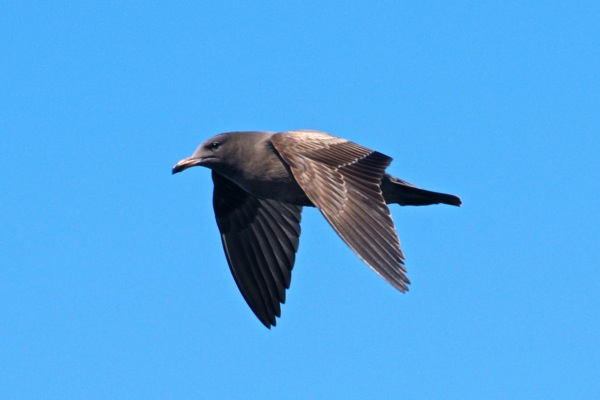
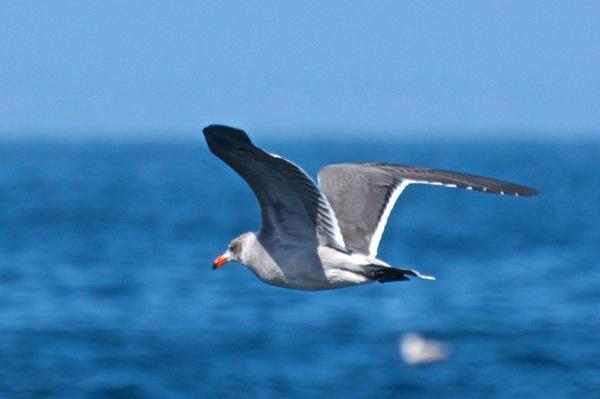
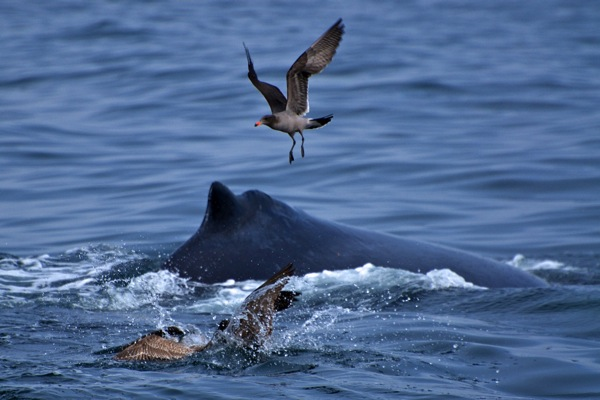

<!-- Generated by fetch-wordpress.py from https://pedrojordano.wordpress.com/2014/01/05/heermanns-gull-in-my-recent-trip-to-california/ — do not edit by hand. -->

```{=html}
<p>These are some shots of my recent trip to California, last October, where I had the opportunity to do a whale watching trip offshore Monterrey Bay, from Moss Landing. I’ll be posting more photos soon…</p>
<p>Heermann’s (<em>Larus heermanni</em> (Cassin, 1852) is one of my favorite gulls, with a beautiful plain grey plumage in the adult, contrasting with the white patches and the coral-red bill, and a smooth dark brown plumage of the immature birds.  They were common birds along the coast up to Santa Cruz, quite often in large flocks. The population size is estimated in ca. 150000 pairs.</p>
<p></p>
<p>The adult birds here seem to be starting with the winter plumage, with paler grey heads.</p>
<p></p>
<p>This is a  typical juvenile bird facing its 1st winter. The head is very dark grey, with a creamy base of the bill.</p>
<p></p>
<p>I like the broad white trailing edge of the wing. It’s a very elegant gull in flight (well, as all the gulls). I’m getting a gull-addicted, even for the commonest species, which pose very nice identification problems when you try to get to the details of the plumage patterns and molt. Even the most common species (i.e., the yellow-legged here in S Spain) pose amazing identification challenges, especially in winter.</p>
<p></p>
<p>And here, with the Humpback whale…</p>
<p>The photos were taken with the Nikon D7000, AF-S VR Zoom-Nikkor 70-300mm f/4.5-5.6G IF-ED, f8, 1/1000, ISO 400.</p>

```

::: {.wp-original}
Originally published on [my WordPress blog](https://pedrojordano.wordpress.com/2014/01/05/heermanns-gull-in-my-recent-trip-to-california/).
:::
