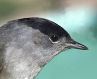
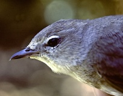
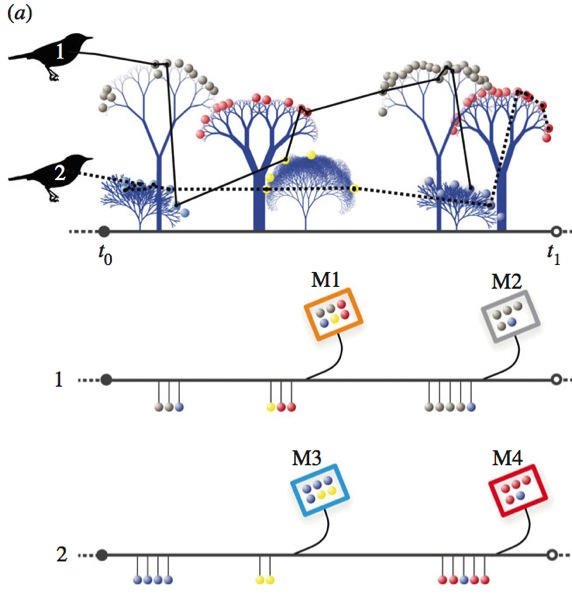

<!-- Generated by fetch-wordpress.py from https://pedrojordano.wordpress.com/2014/01/08/how-do-furgivorus-birds-build-up-their-fruit-meals/ — do not edit by hand. -->

```{=html}
<p>This is the third part of a trilogy of papers dedicated to understanding the evolution of fruit colors and visual signals evolved by plants to attract animal mutualists. The paper is now available online at the Proceedings of the Royal Society, Biology <a href="http://rspb.royalsocietypublishing.org/content/281/1777/20132516.full">website</a>.</p>
<p>Theory predicts that trade among mutualists requires high reliability. Here, we show that moderate reliability already allows mutualists to optimize their rewards. The colours of Mediterranean fleshy-fruits indicate lipid rewards (but not other nutrients) to avian seed dispersers on regional and local scales. On the regional scale, fruits with high lipid content were significantly darker and less chromatic than congeners with lower lipid content.</p>
<p></p>
<p>On the local scale, two warbler species (<em>Sylvia atricapilla</em> and <em>Sylvia </em><em>borin</em>, above) selected fruit colours that were less chromatic, and thereby maximized their intake of lipids—a critical resource during migration and wintering.</p>
<p></p>
<p><em>Figure. The trade of resources characterizing mutualistic interactions leads to multiple, repeated interactions among individual producers and consumers. For example, birds use visual information to decide which fruits to consume. Two individual birds combine different fruit species in their meals during a short feeding bout (t0 − t1), along their foraging sequence, in which they visited different fruiting plants. M1–M4 indicate the composition of four meals, i.e. the number of fruits consumed and their species identity, different fruits with different colours. We analyzed the combination of colors in field-sampled fruit meals in relation to the nutrient composition and food “reward” obtained by the birds. Birds used markedly non-random combinations of colors in their meals, indicating a significant choice of fruit meals maximizing energy intake.</em></p>
<p>In a passage and wintering area in SW Spain where I intensively studied these birds, the two warbler species consistently selected fruit color combinations that were significantly less chromatic, evidencing the use of color as a cue of nutrient rewards during short feeding bouts. Being extremely dependent on fleshy fruits during migration and wintering, these warblers use a very diverse set of fruit species to build-up reserves required for long-distance flights (garden warbler) or winter survival (blackcap).</p>
<p>It is amazing how selective were these birds in their choice of fruits. Even in a short feeding bout blackcaps can ingest up to seven different fruit species. I used analyses of fecal pellets, identifying not only seeds, but also fruit skins in the remains using a microscope, which enabled me to identify the number of different fruit species consumed during a short feeding bout. The fruit meals thus combine a varied assortment of flavors, pulp types, etc. The warblers have a very short gut passage time (16 moon on average- and up to 40 min), so that a sample of faecal material indicates the previous choices of fruits made by the bird, immediately before capture. I used mist-netted birds that were released after capture.</p>
<p>Warblers need to maintain a high throughput of fruits when relying on fruit food because fleshy fruits are a quite “diluted” type of food: not only they are rich in water, quite succulent, but they also have indigestible seeds that occupy very valuable space within the bird’s gut. The birds need to process all this stuff very rapidly in order to get enough “reward”. In turn this is good for the plant because the seeds are readily dispersed away from the mother plant. This is a mutualistic interaction driven by the visual cues used by the birds.</p>
<p>Our results indicate that mutualisms require only that any association between the quality and sensory aspects of signallers is learned through multiple, repeated interactions. Because these conditions are often fulfilled, also in social communication systems, we contend that selection on reliability is less intense than hitherto assumed. This may contribute to explaining the extraordinary diversity of signals, including that of plant reproductive displays.</p>

```

::: {.wp-original}
Originally published on [my WordPress blog](https://pedrojordano.wordpress.com/2014/01/08/how-do-furgivorus-birds-build-up-their-fruit-meals/).
:::
