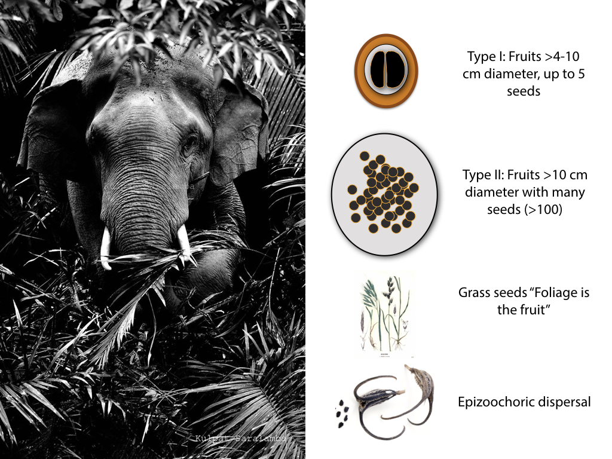

<!-- Generated by fetch-wordpress.py from https://pedrojordano.wordpress.com/2016/12/16/how-to-make-a-megafauna-fruit/ — do not edit by hand. -->

```{=html}
<p>Just make it big, very big. Well, it’s not just that…- yet we’ll probably agree that megafauna fruits are, in some sense, overbuilt.<br/>
If we take the two major types of fruits that extant megafauna consume (e.g., elephants, rhino, etc.), we find two distinct typoplogies. Both are extremely large-sized fruits forms. The first one is like a drupaceous mega-cherry, a large fruit with a single, or very few (i.e., up to three or four) large individual seeds; the second type is kind of a mega-tomato, a large fruit with many, really many (up to hundreds), tiny seeds. Fruits of the first type are usually 4-10 cm diameter; those of the second type are usually &gt; 10 cm in diameter.</p>
<p><figure aria-describedby="caption-attachment-580" class="wp-caption alignright" data-shortcode="caption" id="attachment_580" style="width: 850px"><a href="images/megafauna_functional-001.jpeg"></a><figcaption class="wp-caption-text" id="caption-attachment-580">The two main typologies of (fleshy) fruits eaten by extant megafauna. We should add also the role megafauna had in dispersing seeds of herbs and grasses, as well as epizoochoric seeds like those of devil’s claw (genera Proboscidea, Martynia, and Ibicella, Martyniaceae). Illustration: Pedro Jordano. Photo: Kulpat Saralamba CC 3.0.</figcaption></figure></p>
<p>Why do these fruit types differ when compared to other ‘normal’ fuits? It is not simply that they are much larger. Their key characteristic is that, for a given number of seeds per fruit, they pack up seed sizes up to three orders of magnitude larger than ‘normal’ fruits. Thus, megafaunal fruits allowed plants to circumvent the trade-off between seed size and dispersal by relying on frugivores able to disperse enormous seed loads over long-distances.</p>
<p><figure aria-describedby="caption-attachment-577" class="wp-caption alignright" data-shortcode="caption" id="attachment_577" style="width: 850px"><a href="images/banner77.jpg"></a><figcaption class="wp-caption-text" id="caption-attachment-577">Some fleshy fruited, megafaunal-dependent species from Brazil (Pantanal) illustrating size, shape, and color variation. a, Attalea speciosa, Arecaceae; b, Mouriri elliptica, Melastomataceae; c, Hymenaea stigonocarpa, Fabaceae; d, Genipa americana, Rubiaceae; e, Salacia elliptica, Celastraceae; f, Annona dioica, Annonaceae. Black reference line is 2 cm length. Photos: Pedro Jordano, Mauro Galetti and Camila Donatti.</figcaption></figure></p>
<p>In addition to these two types of megafaunal (fleshy) fruits, the extinct Pleistocene megafauna most likely also dispersed grass seeds and seeds attached to their fur (epizoochoric).</p>
<p>Barlow, C. (2001) Anachronistic fruits and the ghosts who haunt them. Arnoldia, 61, 14–21.<br/>
Bretting, P.K. 1986. Changes in fruit shape in <em>Proboscidea parviflora</em> ssp. <em>parviflora</em> (Martyniaceae) with domestication. Economic Botany, 40, 170-176.<br/>
Feer, F. (1995) Morphology of fruits dispersed by African forest elephants. 
African Journal of Ecology, 33, 279–284.<br/>
<a href="http://journals.plos.org/plosone/article?id=10.1371/journal.pone.0001745" target="_blank">Guimarães Jr., P.R., Galetti, M. &amp; Jordano, P. (2008)</a> Seed dispersal anachronisms: rethinking the fruits extinct megafauna ate. PLoS ONE, 3, e1745.<br/>
Janzen, D. &amp; Martin, P.S. (1982) Neotropical anachronisms: the fruits the gomphotheres ate. Science, 215, 19–27.<br/>
Janzen, D. (1984) Dispersal of small seeds by big herbivores: foliage is the fruit. American Naturalist, 123, 338–353.</p>

```

::: {.wp-original}
Originally published on [my WordPress blog](https://pedrojordano.wordpress.com/2016/12/16/how-to-make-a-megafauna-fruit/).
:::
