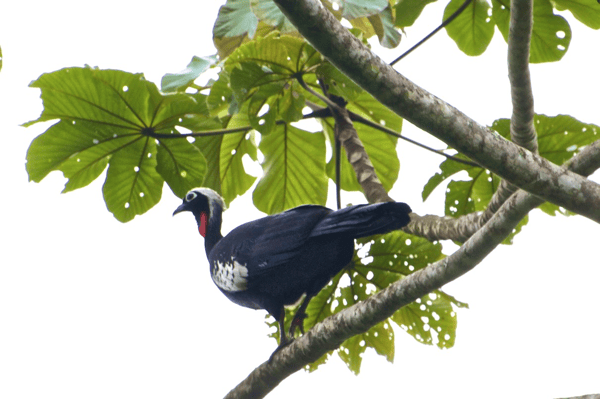

<!-- Generated by fetch-wordpress.py from https://pedrojordano.wordpress.com/2012/03/30/im-just-arrived-from-the-field-course-in-brazil/ — do not edit by hand. -->

```{=html}
<p></p>
<p>I’m just arrived from the <a href="http://www.rc.unesp.br/ib/ecologia/eco2011/cursofrugivoria/" target="_blank">field course</a> in Brazil. Everything run very well and we really enjoyed this edition. Here is a photo of <em>Aburria jacutinga</em> in a <em>Cecropia glazouvi</em> tree. I’ve uploaded more photos in my FB portal.</p>

```

::: {.wp-original}
Originally published on [my WordPress blog](https://pedrojordano.wordpress.com/2012/03/30/im-just-arrived-from-the-field-course-in-brazil/).
:::
