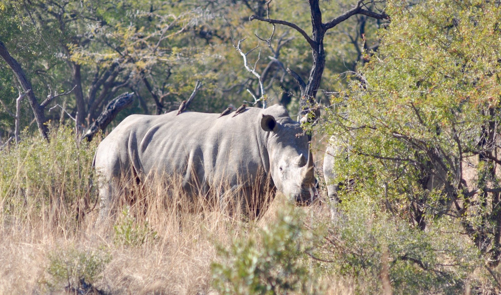
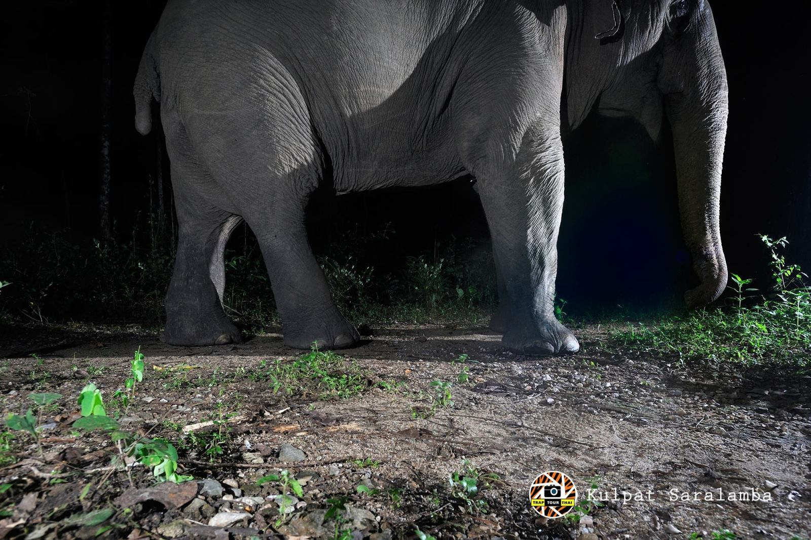
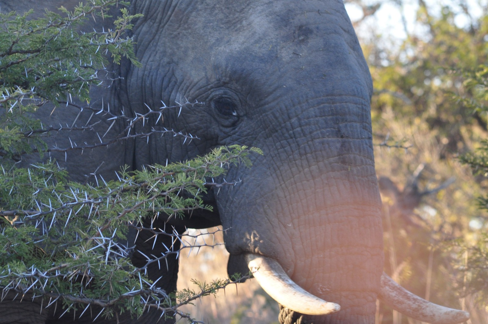
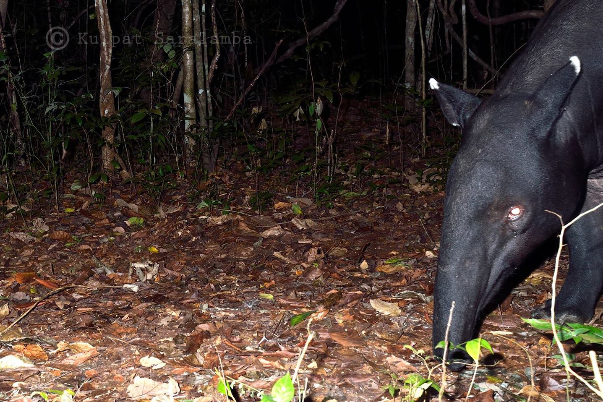
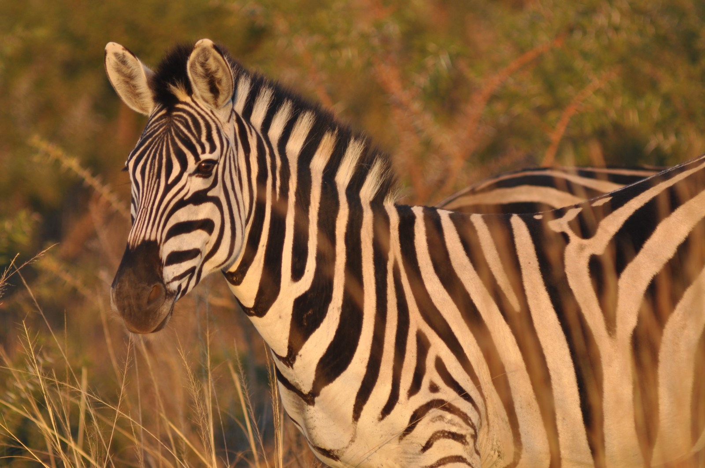
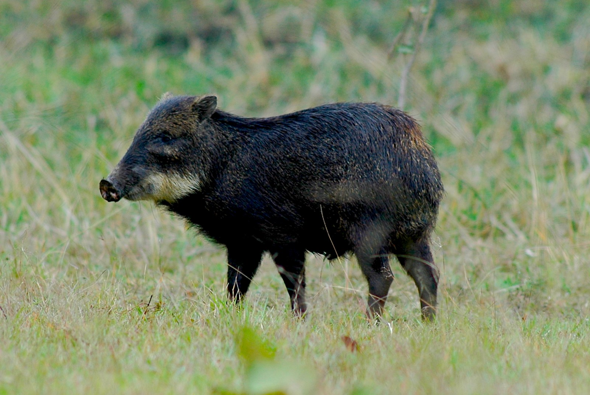

<!-- Generated by fetch-wordpress.py from https://pedrojordano.wordpress.com/2016/12/28/it-takes-guts-to-disperse-seeds-the-amazing-physiologies-of-megafauna/ — do not edit by hand. -->

```{=html}
<p>Megafauna can be divided in two large groups in terms of food digestion: foregut and hindgut fermenters, depending on where in the digestive tract the ingesta is digested. Foregut fermenters include ruminants, pseudoruminants (i.e., hippo, camelids), just the hoatzin among birds, and the colobine monkeys, sloths, and some marsupials and rodents- all them have complex, multipart stomachs. Hindgut fermenters are monogastric herbivores.</p>
<p>The very large megafauna are largely non-ruminants and may have either foregut or hindgut fermentation of food, with this having very important consequences for seed treatment. While the largest extant non-ruminant foregut fermenter is the hippopothamus, the largest terrestrial animals nowadays are hindgut fermenters, with the exception of large bovids: elephants, rhinos, equids, tapirs.</p>
<p>Interestingly, the digestive tract of elephants is surprisingly short compared to other herbivorous mammals. Typical retention times of ingesta in elephants are below 50h; with Asian elephants achieving higher digestion coefficients on comparable diets, and having longer ingesta mean retention times, than their African counterparts. This is probably associated to the fact that intestine lengths of Asian elephants (~30m) nearly double those of African elephants (~15m) for a given body mass.</p>
<p><figure aria-describedby="caption-attachment-700" class="wp-caption alignnone" data-shortcode="caption" id="attachment_700" style="width: 1024px"><figcaption class="wp-caption-text" id="caption-attachment-700">The diversity of digestive systems among several types of mammal hindgut fermenters. a, peccary; b, pig; c, zebra; d, tapir; e, African elephant; f, Asian elephant; g, rhino.</figcaption></figure></p>
<p>Tapirs, in the order Perissodactyla, are the closest extant relatives to equids and rhinoceroses, thus their digestive tract reportedly resembles that of horses. They both have a large caecum and proximal colon as fermentation chambers. In both the horse and the rhinoceros, the caecum and colon have approximately the same width. In contrast, the tapir also has a large caecum, but the rest of the large intestine—in particular, the ventral proximal colon— is less voluminous. The caecum of the tapir is its most voluminous gastro-intestinal section, suggesting that during the evolutionary history of tapirs, and in contrast to other extant perissodactyls, the caecum was the major fermentation site in the digestive tract.</p>
<p><div class="tiled-gallery type-rectangular tiled-gallery-unresized" data-carousel-extra='{"blog_id":14689808,"permalink":"https:\/\/pedrojordano.wordpress.com\/2016\/12\/28\/it-takes-guts-to-disperse-seeds-the-amazing-physiologies-of-megafauna\/","likes_blog_id":14689808}' data-original-width="840" itemscope="" itemtype="http://schema.org/ImageGallery"> <div class="gallery-row" data-original-height="325" data-original-width="840" style="width: 840px; height: 325px;"> <div class="gallery-group images-1" data-original-height="325" data-original-width="548" style="width: 548px; height: 325px;"> <div class="tiled-gallery-item tiled-gallery-item-large" itemprop="associatedMedia" itemscope="" itemtype="http://schema.org/ImageObject"> <a border="0" href="https://pedrojordano.wordpress.com/2016/12/28/it-takes-guts-to-disperse-seeds-the-amazing-physiologies-of-megafauna/dsc_0544-1/" itemprop="url"> <meta content="544" itemprop="width"/> <meta content="321" itemprop="height"/>  </a> </div> </div> <!-- close group --> <div class="gallery-group images-1" data-original-height="325" data-original-width="292" style="width: 292px; height: 325px;"> <div class="tiled-gallery-item tiled-gallery-item-large" itemprop="associatedMedia" itemscope="" itemtype="http://schema.org/ImageObject"> <a border="0" href="https://pedrojordano.wordpress.com/2016/12/28/it-takes-guts-to-disperse-seeds-the-amazing-physiologies-of-megafauna/537px-sumatran_rhinoceros_way_kambas_2008_crop-2/" itemprop="url"> <meta content="288" itemprop="width"/> <meta content="321" itemprop="height"/>  </a> </div> </div> <!-- close group --> </div> <!-- close row --> <div class="gallery-row" data-original-height="379" data-original-width="840" style="width: 840px; height: 379px;"> <div class="gallery-group images-1" data-original-height="379" data-original-width="567" style="width: 567px; height: 379px;"> <div class="tiled-gallery-item tiled-gallery-item-large" itemprop="associatedMedia" itemscope="" itemtype="http://schema.org/ImageObject"> <a border="0" href="https://pedrojordano.wordpress.com/2016/12/28/it-takes-guts-to-disperse-seeds-the-amazing-physiologies-of-megafauna/elephant-2/" itemprop="url"> <meta content="563" itemprop="width"/> <meta content="375" itemprop="height"/>  </a> </div> </div> <!-- close group --> <div class="gallery-group images-2" data-original-height="379" data-original-width="273" style="width: 273px; height: 379px;"> <div class="tiled-gallery-item tiled-gallery-item-large" itemprop="associatedMedia" itemscope="" itemtype="http://schema.org/ImageObject"> <a border="0" href="https://pedrojordano.wordpress.com/2016/12/28/it-takes-guts-to-disperse-seeds-the-amazing-physiologies-of-megafauna/dsc_0022/" itemprop="url"> <meta content="269" itemprop="width"/> <meta content="179" itemprop="height"/>  </a> </div> <div class="tiled-gallery-item tiled-gallery-item-large" itemprop="associatedMedia" itemscope="" itemtype="http://schema.org/ImageObject"> <a border="0" href="https://pedrojordano.wordpress.com/2016/12/28/it-takes-guts-to-disperse-seeds-the-amazing-physiologies-of-megafauna/captura-de-pantalla-2016-12-23-a-las-8-55-28-pm/" itemprop="url"> <meta content="269" itemprop="width"/> <meta content="192" itemprop="height"/>  </a> </div> </div> <!-- close group --> </div> <!-- close row --> <div class="gallery-row" data-original-height="376" data-original-width="840" style="width: 840px; height: 376px;"> <div class="gallery-group images-2" data-original-height="376" data-original-width="281" style="width: 281px; height: 376px;"> <div class="tiled-gallery-item tiled-gallery-item-large" itemprop="associatedMedia" itemscope="" itemtype="http://schema.org/ImageObject"> <a border="0" href="https://pedrojordano.wordpress.com/2016/12/28/it-takes-guts-to-disperse-seeds-the-amazing-physiologies-of-megafauna/tapir-3/" itemprop="url"> <meta content="277" itemprop="width"/> <meta content="184" itemprop="height"/>  </a> </div> <div class="tiled-gallery-item tiled-gallery-item-large" itemprop="associatedMedia" itemscope="" itemtype="http://schema.org/ImageObject"> <a border="0" href="https://pedrojordano.wordpress.com/2016/12/28/it-takes-guts-to-disperse-seeds-the-amazing-physiologies-of-megafauna/dsc_0463/" itemprop="url"> <meta content="277" itemprop="width"/> <meta content="184" itemprop="height"/>  </a> </div> </div> <!-- close group --> <div class="gallery-group images-1" data-original-height="376" data-original-width="559" style="width: 559px; height: 376px;"> <div class="tiled-gallery-item tiled-gallery-item-large" itemprop="associatedMedia" itemscope="" itemtype="http://schema.org/ImageObject"> <a border="0" href="https://pedrojordano.wordpress.com/2016/12/28/it-takes-guts-to-disperse-seeds-the-amazing-physiologies-of-megafauna/white_lipped_peccary/" itemprop="url"> <meta content="555" itemprop="width"/> <meta content="372" itemprop="height"/>  </a> </div> </div> <!-- close group --> </div> <!-- close row --> </div><br/>
The caecum of rhinos, horses, and probably also tapirs may retain seeds for many days (kind of a side-storage of indigestible food), being suddenly evacuated in pulses. The browsing black rhinoceros (<em>Diceros bicornis</em>) has both shorter small and large intestines than the grazing rhinoceroses (<em>Ceratotherium simum</em>, <em>Rhinoceros unicornis</em>).</p>
<p>Peccaries in contrast, are foregut fermenters, with a digestive tract characterised by an elaborate forestomach. Peccaries have a small relative stomach volume compared to other foregut fermenters, which implies a comparatively lower fermentative capacity and thus forage digestibility. The forestomach could enable peccaries to deal, in conjunction with their large parotis glands, with certain plant toxins (e.g. oxalic acid).</p>
<p>This fascinating diversity of digestive strategies and food processing has undoubtely emerged from coevolved interactions with plants, either as antagonistic herbivores or mutualistic seed dispersers. Plants were benefited by megafauna evolving very large body sizes (especially among monogastric hindgut fermenters), yet with relatively short retention times that did not damage seeds, even with a lengthy digestion process; however, with more limitations to detoxify plant toxins compared to ruminants. Many of the extremely large extinct megafauna (e.g., <em>Indricotherium</em>, reaching up to 15000 kg body mass) were most likely hindgut fermenters with browsing habits and extensive use of fruit food. Ruminants, on the other hand, have been likely limited in their evolution to smaller body sizes (up to 1200 kg in some bovids, 2700 kg in hippos). All the very large ruminants (bovids, buffalo, zebu), but not the smaller ones (e.g., antelopes) lack the ability to reabsorb water in the colon and depend on the availability of drinking water.</p>
<p>The combinations of digestive characteristics of monogastric hindgut fermenters supports their key ecologial functions for seed dispersal: 1) ample diversity of plant food species dispersed; 2) extremely large number of seeds dispersed due to huge gut capacities; 3) long seed dispersal distances due to long retention times with a distinct role of caeca; and 4) gentle treatment to seeds during mastication and digestion, favouring adequate germination potential of dispersed seeds in most instances.</p>
<p>Photos: Kulpat Saralamba, Kim McKonkey, Mauro Galetti, Carlos R Brocardo, WikiCommons.</p>
<ul>
<li>Clauss, M. &amp; Hummel, J. (2005) The digestive performance of mammalian herbivores: why big may not be that much better. Mammal Review, 35, 174–187.</li>
<li>Clauss, M., Steinmetz, H., Eulenberger, U., Ossent, P., Zingg, R., Hummel, J. &amp; Hatt, J.M. (2006) Observations on the length of the intestinal tract of African <em>Loxodonta africana</em> (Blumenbach 1797) and Asian elephants <em>Elephas maximus</em> (Linné 1735). European Journal of Wildlife Research, 53, 68–72.</li>
<li>Clauss M, Steuer P, Müller DWH, Codron D, Hummel J (2013) Herbivory and body size: allometries of diet quality and gastrointestinal physiology, and implications for herbivore ecology and dinosaur gigantism. PLoS One 8:e68714</li>
<li>Hagen, K., Müller, D.W.H., Wibbelt, G., Ochs, A., Hatt, J.-M. &amp; Clauss, M. (2014) The macroscopic intestinal anatomy of a lowland tapir (<em>Tapirus terrestris</em>). European Journal of Wildlife Research, 61, 171–176.</li>
<li>Müller, D.W.H., Codron, D., Meloro, C., Munn, A., Schwarm, A., HUMMEL, J. &amp; Clauss, M. (2013) Assessing the Jarman–Bell Principle: Scaling of intake, digestibility, retention time and gut fill with body mass in mammalian herbivores. Comparative Biochemistry and Physiology, Part A, 164, 129–140.</li>
<li>Schwarm, A., Ortmann, S., Rietschel, W., Kühne, R., Wibbelt, G. &amp; Clauss, M. (2009) Function, size and form of the gastrointestinal tract of the collared <em>Pecari tajacu</em> (Linnaeus 1758) and white-lipped peccary <em>Tayassu pecari</em> (Link 1795). European Journal of Wildlife Research, 56, 569–576.</li>
</ul>

```

::: {.wp-original}
Originally published on [my WordPress blog](https://pedrojordano.wordpress.com/2016/12/28/it-takes-guts-to-disperse-seeds-the-amazing-physiologies-of-megafauna/).
:::
