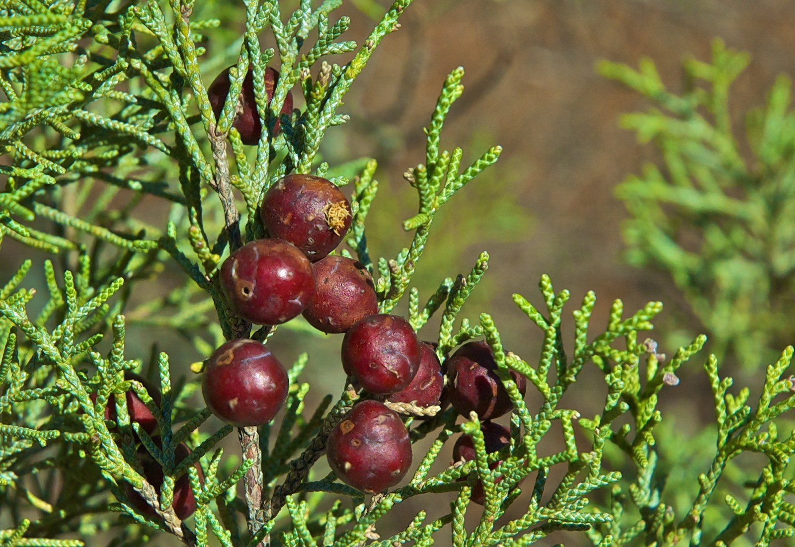

<!-- Generated by fetch-wordpress.py from https://pedrojordano.wordpress.com/2024/08/31/junipers/ — do not edit by hand. -->

```{=html}

<div class="wp-block-media-text alignwide has-background has-light-gray-background-color" style="grid-template-columns:64% auto"><figure class="wp-block-media-text__media"></figure><div class="wp-block-media-text__content">
<p class="has-small-font-size wp-block-paragraph"><em>Juniperus phoenicea</em> cones. Doñana Biological Reserve, Huelva, Spain.</p>
</div></div>
<p class="has-medium-font-size wp-block-paragraph">Last year we started a new project after finishing two relevant ones. One was a large LifeWatch project that deserves an in-depth and better commentary in an upcoming post. Our previous project, funded by <a href="https://www.aei.gob.es/" rel="noreferrer noopener" target="_blank">the Agencia Estatal de Investigación</a> (Spain) aimed to understand how plant-animal interactions are reshaped in long-lived trees when environmental conditions favor the expansion of area and a rapid advance in the plant’s distribution. This is a likely scenario under global change, when plant will need a quick migration to avoid e.g., increasing temperatures.<br/><br/>Our project focused on mutualistic and antagonistic interactions in junipers, <em>Juniperus phoenicea</em>, and we aimed to document the whole set of biotic interactions for trees in different environmental scenarios. We studied a gradient between old, mature stands and the colonization front during area expansion of the tree in Doñana Biological Reserve (Spain). Junipers have been expanding vigorously in the area during the last 40 years and we aimed to document and model the changes in biotic interactions, both mutualistic and antagonistic, taking place along this dynamic gradient of population advance.</p>
<p class="wp-block-paragraph">The project led to Jorge Isla’s PhD project, now completed, and a series of interesting papers that you may find <a href="http://pjordanolab.ebd.csic.es/papers/" rel="noreferrer noopener" target="_blank">here</a>.</p>

```

::: {.wp-original}
Originally published on [my WordPress blog](https://pedrojordano.wordpress.com/2024/08/31/junipers/).
:::
