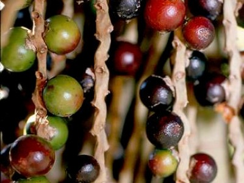

<!-- Generated by fetch-wordpress.py from https://pedrojordano.wordpress.com/2008/02/01/just-arrived-from-brazil-im-just-arrived-from-a/ — do not edit by hand. -->

```{=html}
<p></p>
<p><strong>Just arrived from Brazil</strong></p>
<p>I’m just arrived from a trip to Brazil. This time Mauro is in Stanford university, so I was doing field work in Ilha de Cardoso ‘bem soazinho’, working with spatial patterns of recruitment in the palm <em>Euterpe edulis</em>, one of our favorite species there. In addition I went to Parque Estadual Carlos Botelho where I keep taking data on palmito regeneration. Briefly, I was aiming at characterizing the recruitment microhabitats of palmito in these two locations of Atlantic rainforest. I was using hemispherical photographs as well as direct measurements of site traits. In Cardoso I also worked with mapping of seedling, sapling, and adult spatial patterns.</p>

```

::: {.wp-original}
Originally published on [my WordPress blog](https://pedrojordano.wordpress.com/2008/02/01/just-arrived-from-brazil-im-just-arrived-from-a/).
:::
