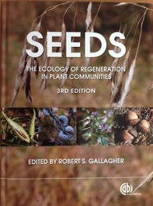

<!-- Generated by fetch-wordpress.py from https://pedrojordano.wordpress.com/2014/01/08/just-published-the-third-edition-of-seeds/ — do not edit by hand. -->

```{=html}
<p style="font-size:15px;">The 3rd edition of the book, originally edited by Michael Fenner, “<a href="http://www.cabdirect.org/abstracts/20133410602.html?resultNumber=9&amp;q=Seeds">Seeds: the ecology of regeneration in natural plant communities</a>” is just published (ISBN 978-1-78064-183-6). It has been edited by R.S. Gallagher, and you can find in it a revised and updated version of my chapter on “Fruits and frugivory”. </p>
<p></p>

```

::: {.wp-original}
Originally published on [my WordPress blog](https://pedrojordano.wordpress.com/2014/01/08/just-published-the-third-edition-of-seeds/).
:::
