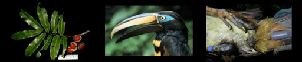

<!-- Generated by fetch-wordpress.py from https://pedrojordano.wordpress.com/2008/02/14/kimberly-arrived-kimberly-holbrook-arrived/ — do not edit by hand. -->

```{=html}
<p></p>
<p><strong>Kimberly arrived</strong></p>
<p>Kimberly Holbrook arrived today. She will be here with a post-doc contract (Juan de la Cierva post-doc from the Spanish Minsterio de Educación), working on seed dispersal patterns of tropical species compared to temperate species. What we want to do is to assess comparatively the long-distance dispersal patterns mediated by tropical and non-tropical frugivores.</p>

```

::: {.wp-original}
Originally published on [my WordPress blog](https://pedrojordano.wordpress.com/2008/02/14/kimberly-arrived-kimberly-holbrook-arrived/).
:::
