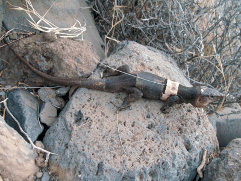

<!-- Generated by fetch-wordpress.py from https://pedrojordano.wordpress.com/2011/07/30/lizards-endemic-island-plants-and-extinctions/ — do not edit by hand. -->

```{=html}
<p><br/>
Seed dispersal by lizards is an insular phenomenon. In the Canary Islands, many fleshy-fruited plants depend on lizards for their successful dispersal and recruitment. We are now working in a project directed by Alfredo Valido to analyze the movement ecology of Canarian endemic <em>Gallotia</em> lizards and its consequences for plant dispersal and recruitment. We study the reproductive ecology of orijama plants <em>Neochamaelea pulverulenta</em>, an endemic Cneoraceae in the islands, whose seeds are exclusively dispersed by the lizards. We combine studies of fine- and medium-scale genetic structure with data and models of foraging movements of the lizards, monitoring with radio-tracking methods. So far the results are superb, and we now have detailed data on movement patterns of <em>Gallotia galloti</em> in Teno Bajo (Tenerife)- our main study site- and <em>G. stehlini</em> (in the photo) in Barranco de Veneguera (Gran Canaria). We have also seeds samples from two 1.2 ha plots in the two sites as well as leaf samples from &gt;2000 plants to assess seed dispersal patterns with genetic methods, similar to those that we’ve been using with <em>Prunus mahaleb</em> and <em>Frangula alnus</em>. We are interested in assessing the potential effects of previous extinctions of other giant lizard species (e.g., <em>G. goliath</em>) that were very good dispersers of orijama. These were up to 1.3 m long and able to disperse even the largest fruits and seeds of orijama, which now remain undispersed on the plants; only the smaller fruits and seeds remain dispersed by the extant smaller lizards.</p>

```

::: {.wp-original}
Originally published on [my WordPress blog](https://pedrojordano.wordpress.com/2011/07/30/lizards-endemic-island-plants-and-extinctions/).
:::
