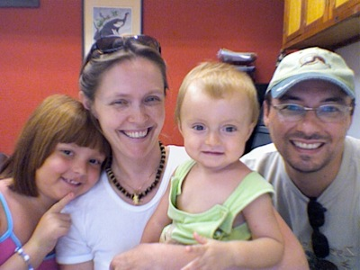

<!-- Generated by fetch-wordpress.py from https://pedrojordano.wordpress.com/2004/03/05/mauro-galetti-visiting-sevilla-mauro-galetti-is/ — do not edit by hand. -->

```{=html}
<p></p>
<p><strong>Mauro Galetti visiting Sevilla</strong></p>
<p>Mauro Galetti is visiting us during March. We will be working on collaboration projects with fleshy fruits characteristics, specifically with Mata Atlantica species. We are also preparing the next frugivory and seed dispersal course in Brazil for next May-June. Our collaboration now has support from a bilateral agreement between Brazilian CNPq and Spanish CSIC. You can find more details about our shared interest in the web page.</p>

```

::: {.wp-original}
Originally published on [my WordPress blog](https://pedrojordano.wordpress.com/2004/03/05/mauro-galetti-visiting-sevilla-mauro-galetti-is/).
:::
