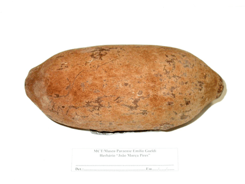

<!-- Generated by fetch-wordpress.py from https://pedrojordano.wordpress.com/2011/10/15/megafauna-fruits-and-seeds-photos-updated/ — do not edit by hand. -->

```{=html}
<p><br/>
I’m in the process of moving photo repositories to iCloud and have my previous photos of megafauna fruits and seeds moved to this gallery. You can access the photos <a href="http://gallery.me.com/pedroj#100068" target="_blank">here</a>.</p>
<p>These photos were taken in the herbarium of Museu Goeldi (Belém, Pará, Brazil) in 2002. They include many of the species we discuss in <a href="http://www.plosone.org/article/info%3Adoi%2F10.1371%2Fjournal.pone.0001745" target="_blank">our paper in PLoS One</a> on megafauna fruits.</p>

```

::: {.wp-original}
Originally published on [my WordPress blog](https://pedrojordano.wordpress.com/2011/10/15/megafauna-fruits-and-seeds-photos-updated/).
:::
