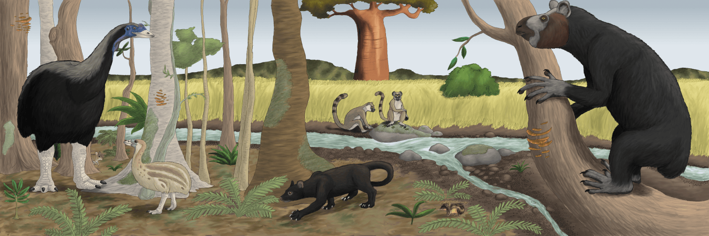

<!-- Generated by fetch-wordpress.py from https://pedrojordano.wordpress.com/2016/12/30/megafauna-in-madagascar/ — do not edit by hand. -->

```{=html}
<p></p>
<p>A scene in Madagascar in the late Pleistocene. From left to right: elephant bird (<em>Aepyornis maximus</em>), Malagasy giant rat (<em>Hypogeomys antimena</em>), melanistic giant fossa (<em>Cryptoprocta spelea</em>), monkey lemur (<em>Archaeolemur</em>), streaked tenrec (<em>Hemicentetes</em>), and koala lemur (<em>Megaladapis</em>).</p>
<p>Madagascar had a highly diversified megafauna, as also occurred in other islands, quickly becoming defaunated because of human action and habitat destruction, starting very recently, ca. 2000 yr BP. For example, the Spiny Thicket Ecoregion (STE) of SW Madagascar was home to numerous giant lemurs and other megafauna, including pygmy hippopotamuses, giant tortoises, elephant birds, and large euplerid carnivores.</p>
<p>Island frugivore faunas are much more phylogenetically diverse than continental ones; their frugivore assemblages are known as disharmonic because a given plant species may depend on distinct sorts of animal seed dispersers (e.g., lizards, birds, mammals) quite distinct in evolutionary history and likely not being complementary in their ecological functions. For example, only one-third of the lemur species which earlier occupied the spiny thicket ecoregion survive today. The extinct lemurs occupied a wide range of niches, often distinct from those filled by non-primates. Many of the now-extinct lemurs regularly exploited habitats that were drier than the gallery forests in which the remaining lemurs of this ecoregion are most often protected and studied. Recent evidence using stable isotope biogeochemistry has shown that most extinct lemurs fed predominantly on C3 plants and some were likely the main dispersers of the large seeds of native C3 trees; others included CAM and/or C4 plants in their diets.<br/>
While the negative effects on seed dispersal of Pleistocene megafauna extinction in continental areas were probably buffered by complementary dispersers (e.g., scatter-hoarders, domestic megafauna, human use), island assemblages had not this option. Thus, if we seek instances of actual co-extinction of co-dependent frugivores and their food plants we may probably have to resort to islands, especially oceanic islands, or extreme habitats (e.g., deserts) where the mutualistic partners are highly disharmonic.</p>
<ul>
<li>Crowley, B.E., Godfrey, L.R. &amp; Irwin, M.T. (2011) A glance to the past: subfossils, stable isotopes, seed dispersal, and lemur species loss in Southern Madagascar. American Journal of Primatology, 73, 25–37.</li>
<li>Grubb, P.J. (2003) Interpreting some outstanding features of the flora and vegetation of Madagascar. Perspectives in Plant Ecology Evolution and Systematics, 6, 125–146.</li>
<li>Jungers, W.L., Demes, B. &amp; Godfrey, L.R. (2007) How big were the “‘giant’” extinct lemurs of madagascar? J. G. Fleagle, C. C. Gilbert (eds.), Elwyn Simons: A Search for Origins. Springer, pp: 1–18.</li>
<li>Shapcott, A., Rakotoarinivo, M., Smith, R.J., Lysakova, G., Fay, M.F. &amp; Dransfield, J. (2007) Can we bring Madagascar’s critically endangered palms back from the brink? Genetics, ecology and conservation of the critically endangered palm <em>Beccariophoenix madagascariensis</em>. Botanical Journal of the Linnean Society, 154, 589–608.</li>
</ul>
<p>Text: Pedro Jordano; excerpts fromCrowley et al. 2011.<br/>
Illustration: William Snyder @deviantart.com (Pleistocene Madagascar).</p>

```

::: {.wp-original}
Originally published on [my WordPress blog](https://pedrojordano.wordpress.com/2016/12/30/megafauna-in-madagascar/).
:::
