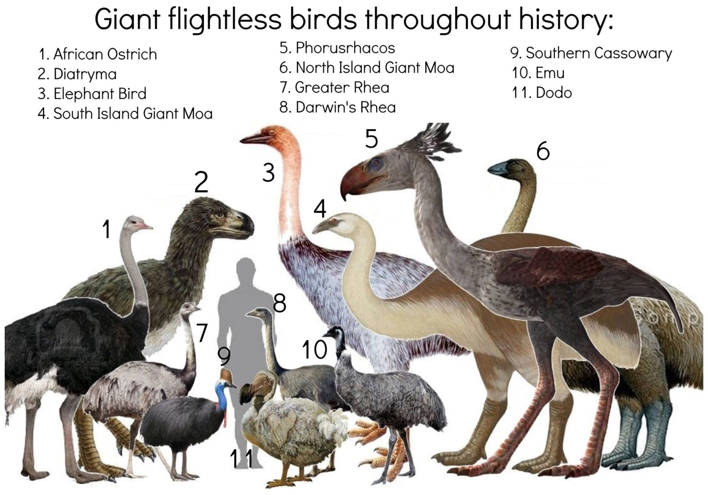

<!-- Generated by fetch-wordpress.py from https://pedrojordano.wordpress.com/2016/12/28/moas/ — do not edit by hand. -->

```{=html}

<p class="wp-block-paragraph">The diversity of moas was extraordinary, including nine (10, for some authors) species in six different genera, all them endemic to New Zealand. They nicely illustrate megafaunal birds, whose extant furgivorous relatives include cassowaries and, with partial frugivory, kiwis.</p>
<div class="wp-block-image">
<figure class="aligncenter size-large is-resized"></figure>
</div>
<p class="wp-block-paragraph"></p>
<p class="wp-block-paragraph">Moas weighted 35-250 kg, becoming extinct ~1300-1440 yr BP due to overhunting. Moas included at least three distinct assemblages in the South Island during the Holocene: a wet western beech forest assemblage consisting of South Island giant (<em>Dinornis robustus</em>) and little bush (<em>Anomalopteryx didiformis</em>) moas; an assemblage from the relatively dry eastern forests and scrublands, consisting of South Island giant, eastern (<em>Emeus crassus</em>), heavy-footed (<em>Pachyornis elephantopus</em>) and stout-legged (<em>Euryapteryx gravis</em>) moas; and an assemblage from upland and subalpine areas consisting of South Island giant, crested (<em>Pachyornis</em> <em>australis</em>) and upland (<em>Megalapteryx</em> <em>didinus</em>) moas.</p>
<p class="wp-block-paragraph">The discovery in New Zealand of Late Holocene deposits of coprolites from these extinct avian megaherbivores has provided a unique opportunity to gain a detailed insight into the ecology of these birds across ecologically diverse habitats. Macrofossil analysis of 116 coprolites of the giant ratite moa (Aves, Dinornithiformes) reveals a diverse diet of herbs and low shrubs in both semi-arid and high rainfall ecological zones, overturning previous models of moa as dominantly browsers of trees and shrubs.<br/>
Ancient DNA analysis identified coprolites from four moa species (South Island giant moa, <em>Dinornis robustus</em>; upland moa, <em>Megalapteryx didinus</em>; heavy-footed moa, <em>Pachyornis elephantopus </em>and stout-legged moa, <em>Euryapteryx gravis</em>), revealing a larger dietary variation between habitat types than between species. Most species of moa, if not all, included fruit in their diets, and may have been also important as dispersers of grass seeds.</p>
<p class="wp-block-paragraph">The new data confirm that moa fed on a variety of endemic plant taxa with unusual growth forms previously suggested to have co-evolved with moa. Lastly, the feeding ecologies of moa are shown to be widely different to introduced mammalian herbivores. The broad range of feeding strategies used by moa, as inferred from interspecific differences in biomechanical performance of the skull, provides insight into mechanisms that facilitated high diversities of these avian megaherbivores in prehistoric New Zealand.</p>
<ul class="wp-block-list">
<li>Atkinson, I.A.E. &amp; Greenwood, R.M. (1989) Relationships between moas and plants. New Zealand Journal of Ecology, 12, 67–96.</li>
<li>Attard, M.R.G., Wilson, L.A.B., Worthy, T.H., Scofield, P., Johnston, P., Parr, W.C.H. &amp; Wroe, S. (2016) Moa diet fits the bill: virtual reconstruction incorporating mummified remains and prediction of biomechanical performance in avian giants. Proceedings of the Royal Society of London Series B-Biological Sciences, 283, 20152043–9.</li>
<li>Bond, W., Lee, W. &amp; Craine, J. (2004) Plant structural defences against browsing birds: a legacy of New Zealand’s extinct moas. Oikos, 104, 500–508.</li>
<li>Burrows, C.J., McCulloch, B. &amp; Trotter, M.M. (1981) The diet of moas based on gizzard contents samples from Pyramid Valley, North Canterbury, and Scaife’s Lagoon, Lake Wanaka, Otago. Records of the Canterbury Museum, 9, 309–336.</li>
<li>Lee, W.G., Wood, J.R. &amp; Rogers, G.M. (2010) Legacy of avian-dominated plant-herbivore systems in New Zealand. New Zealand Journal of Ecology, 34, 1–20.</li>
<li>Wood, J.R., Rawlence, N.J., Rogers, G.M., Austin, J.J., Worthy, T.H. &amp; Cooper, A. (2008) Coprolite deposits reveal the diet and ecology of the extinct New Zealand megaherbivore moa (Aves, Dinornithiformes). Quaternary Science Reviews, 27, 2593–2602.</li>
<li>Wood, J.R., Wilmshurst, J.M., Richardson, S.J., Rawlence, N.J., Wagstaff, S.J., Worthy, T.H. &amp; Cooper, A. (2013) Resolving lost herbivore community structure using coprolites of four sympatric moa species (Aves: Dinornithiformes). Proceedings of the National Academy of Sciences USA, 110, 16910–16915.</li>
</ul>

```

::: {.wp-original}
Originally published on [my WordPress blog](https://pedrojordano.wordpress.com/2016/12/28/moas/).
:::
