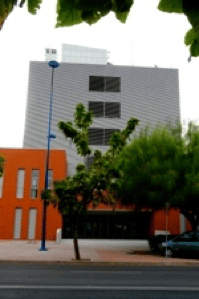

<!-- Generated by fetch-wordpress.py from https://pedrojordano.wordpress.com/2009/02/07/moving-to-a-new-building-it-has-been-a-long-time/ — do not edit by hand. -->

```{=html}
<p></p>
<p><strong>Moving to a new building</strong></p>
<p>It has been a long time since my last post here… We are now in a new house: at <a href="http://maps.google.es/maps/ms?hl=es&amp;ie=UTF8&amp;msa=0&amp;msid=116104561674763217347.00045856ade2d8647e842&amp;ll=37.394982,-5.995445&amp;spn=0.047733,0.072956&amp;z=13&amp;source=embed" target="_blank">Isla de La Cartuja</a>. Much better in terms of functionality and space but without the lovely charm of Pabellon del Perú. We moved to the Pabellon in April 1984, so it’s been a long time there.</p>

```

::: {.wp-original}
Originally published on [my WordPress blog](https://pedrojordano.wordpress.com/2009/02/07/moving-to-a-new-building-it-has-been-a-long-time/).
:::
