<!-- Generated by fetch-wordpress.py from https://pedrojordano.wordpress.com/2012/07/07/muriquis/ — do not edit by hand. -->

```{=html}
<p>Muriquis (<em>Brachyteles arachnoides</em>) are the largest neotropical primates and the largest mammal endemic to Brazil, reaching more than 12 kg (Reis <em>et al.</em>, 2006). They are endemic to the SE Brazil.</p>
<p>Previously recorded as different subspecies, muriquis are currently recognized as two distinct species, the northern muriqui <em>B. hypoxanthus </em>and southern muriqui <em>B. arachnoides</em> (Rylands <em>et al</em>., 1997). Aguirre (1971) estimated that before the arrival of Europeans there were about 400,000 muriquis in the Atlantic rainforest, distributed from southern Bahia to northern Paraná, and in 1971 there were no more than 3,000 individuals. Currently the northern muriqui occurs in southern Bahia, Espirito Santo and Minas Gerais and the southern muriqui occurs in southern Rio de Janeiro, São Paulo and northern Paraná (Melo and Dias 2005, Hirsch <em>et al</em>., 2006).</p>
<p><div class="gallery galleryid-229 gallery-columns-3 gallery-size-thumbnail" data-carousel-extra='{"blog_id":14689808,"permalink":"https://pedrojordano.wordpress.com/2012/07/07/muriquis/"}' id="gallery-229-7"><figure class="gallery-item">
<div class="gallery-icon landscape">
<a href="images/brachyteles-arachnoides-077.jpg">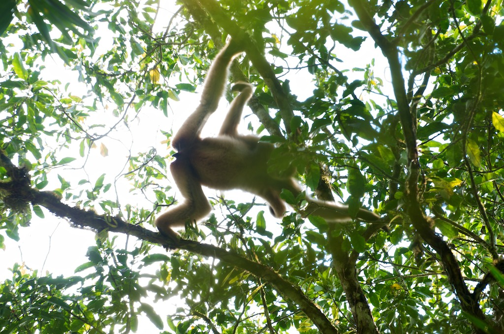</a>
</div></figure><figure class="gallery-item">
<div class="gallery-icon landscape">
<a href="images/brachyteles-arachnoides-087.jpg">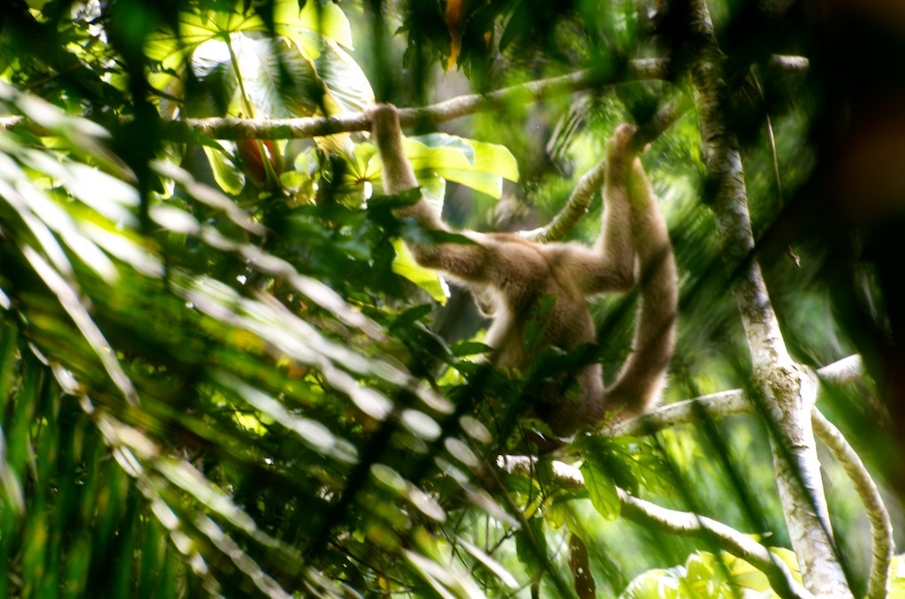</a>
</div></figure><figure class="gallery-item">
<div class="gallery-icon landscape">
<a href="images/brachyteles-arachnoides-088.jpg">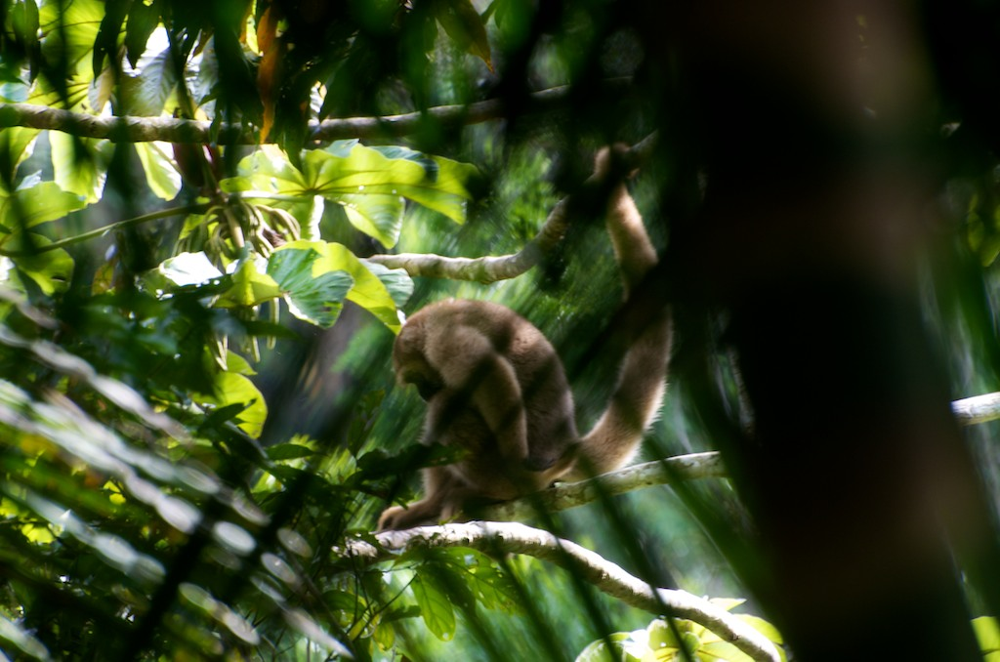</a>
</div></figure><figure class="gallery-item">
<div class="gallery-icon portrait">
<a href="images/brachyteles-arachnoides-096.jpg">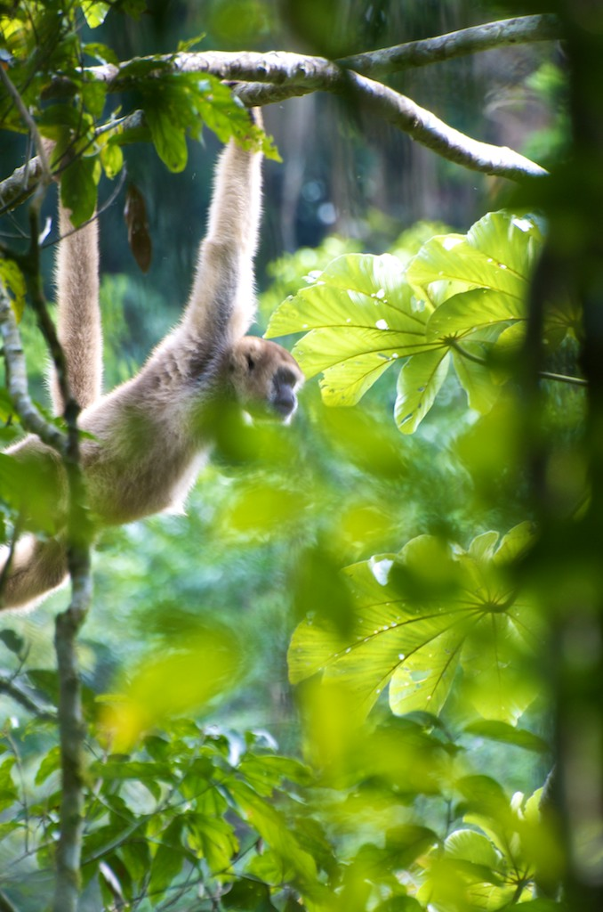</a>
</div></figure><figure class="gallery-item">
<div class="gallery-icon landscape">
<a href="images/brachyteles-arachnoides-104.jpg">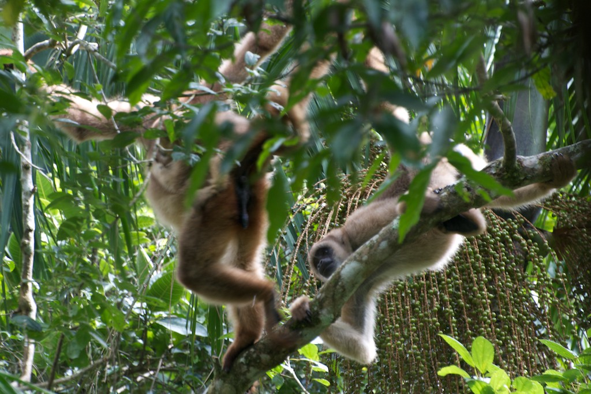</a>
</div></figure><figure class="gallery-item">
<div class="gallery-icon landscape">
<a href="images/brachyteles-arachnoides-109.jpg">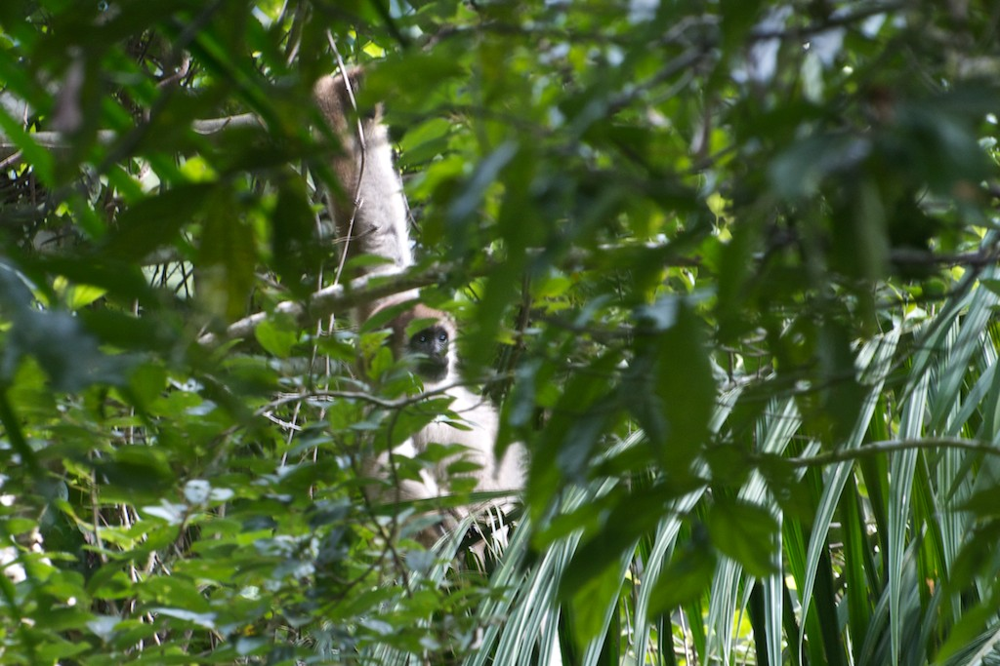</a>
</div></figure><figure class="gallery-item">
<div class="gallery-icon landscape">
<a href="images/brachyteles-arachnoides-115.jpg">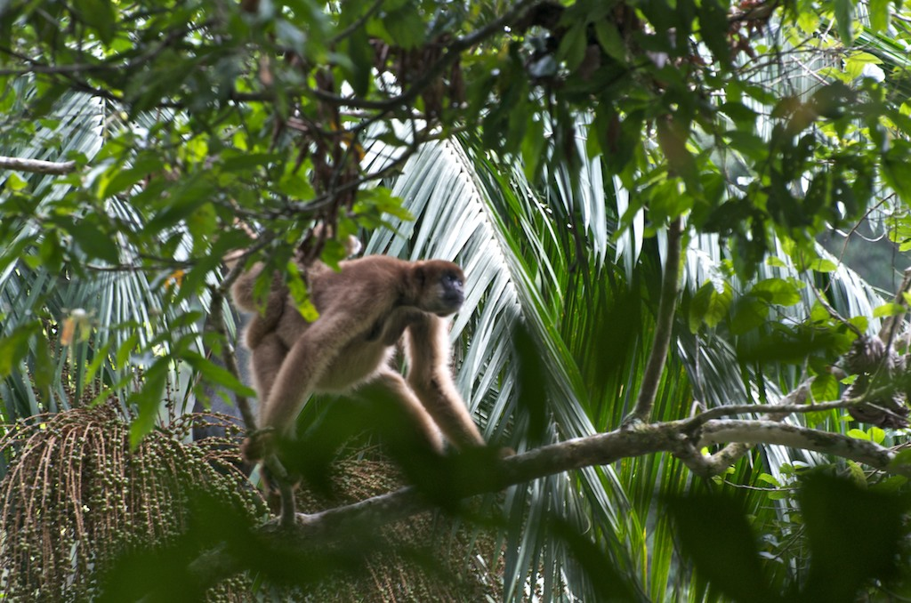</a>
</div></figure><figure class="gallery-item">
<div class="gallery-icon landscape">
<a href="images/brachyteles-arachnoides-116.jpg">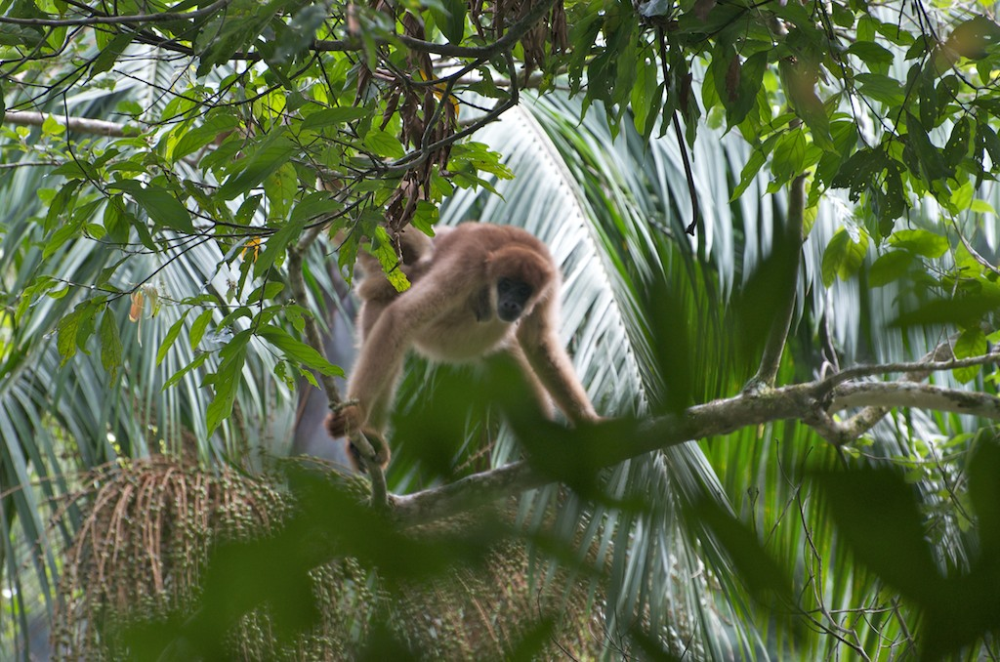</a>
</div></figure><figure class="gallery-item">
<div class="gallery-icon landscape">
<a href="images/brachyteles-arachnoides-123.jpg">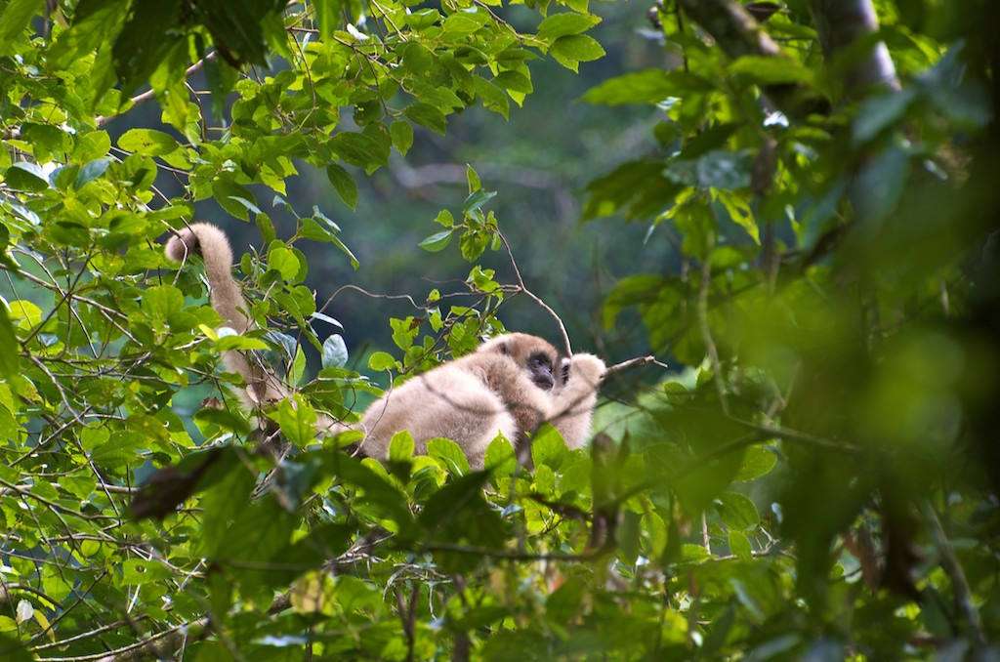</a>
</div></figure><figure class="gallery-item">
<div class="gallery-icon landscape">
<a href="images/brachyteles-arachnoides-128.jpg">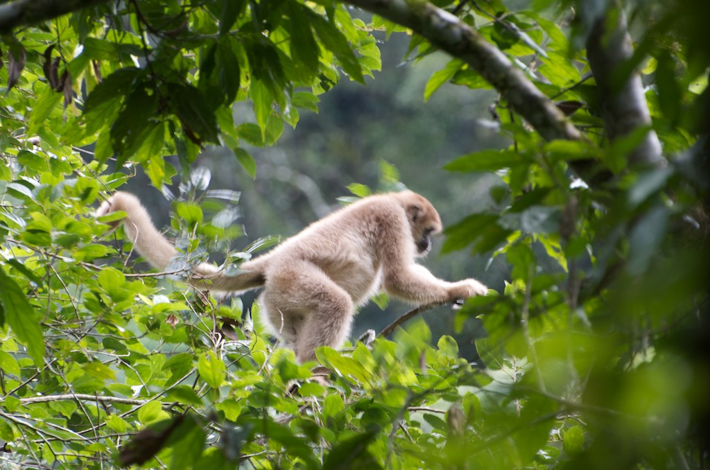</a>
</div></figure><figure class="gallery-item">
<div class="gallery-icon landscape">
<a href="images/brachyteles-arachnoides-129.jpg">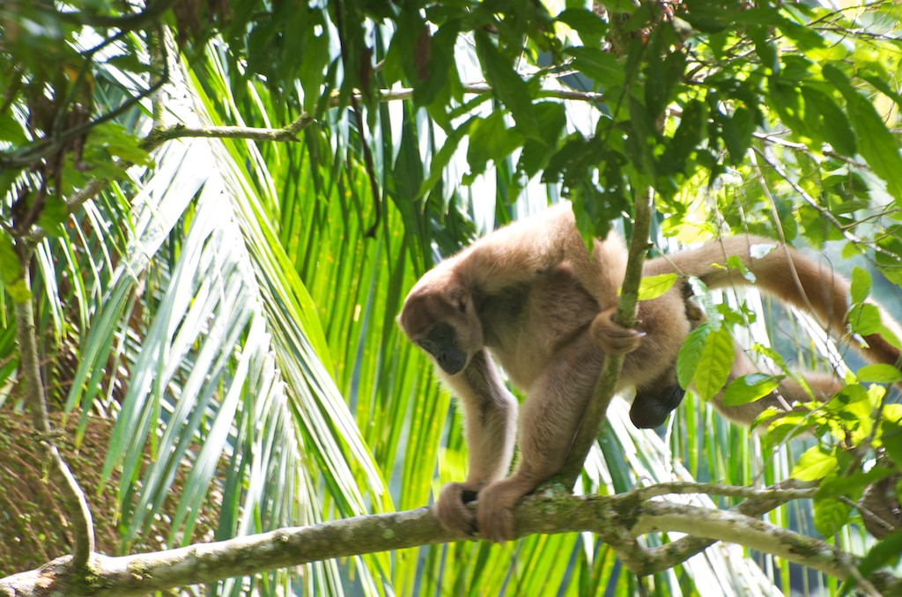</a>
</div></figure><figure class="gallery-item">
<div class="gallery-icon landscape">
<a href="images/brachyteles-arachnoides-130.jpg">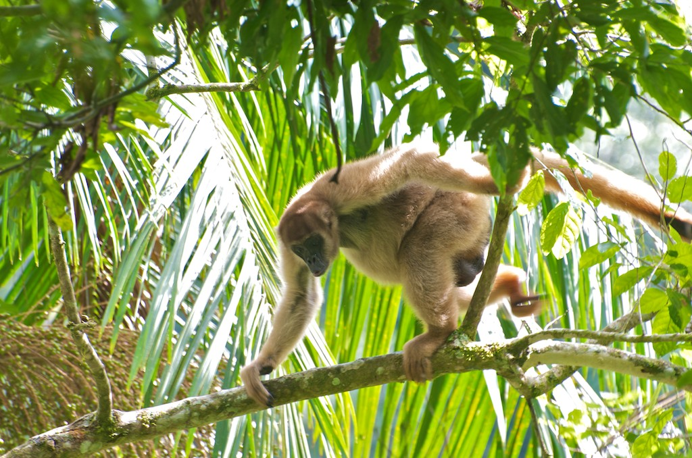</a>
</div></figure><figure class="gallery-item">
<div class="gallery-icon landscape">
<a href="images/brachyteles-arachnoides-131.jpg">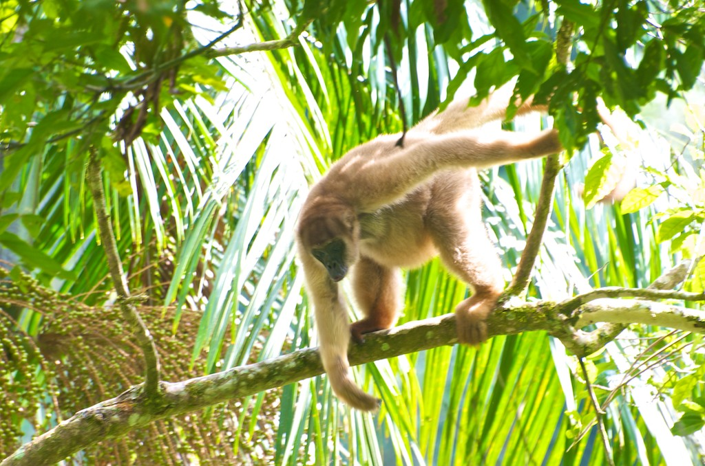</a>
</div></figure><figure class="gallery-item">
<div class="gallery-icon landscape">
<a href="images/brachyteles-arachnoides-132.jpg">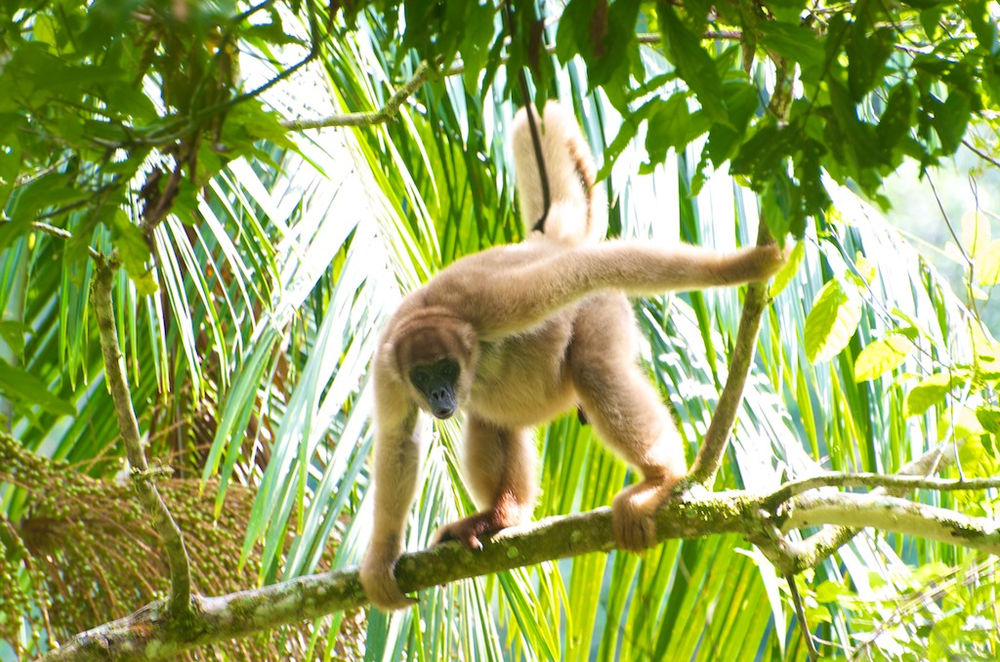</a>
</div></figure>
</div>
</p>
<p>The muriquis live in groups of more than 30 individuals present social fission-fusion system where the group is divided into independent sub-groups of variable size. When in pristine areas they have a higher home ranges, ca. 1000ha, within daily displacements more than 5 km. I was fortunate enough to watch a group of 10-11 muriquis in Intervales, relatively close to the Carmo base. They were 3 males, 2-3 juveniles and 3 females, two of them carrying babies. Some of the individuals were feeding on the catkins of <em>Cecropia glazeouvi</em>. I approached them on a very steep slope and observed them for ca. 30 min. They were moving slowly among the canopies of the trees but with an extraordinary agility, always helping themselves with the tail. After a period close to me they moved quickly uphill.</p>
<p>Muriquis are herbivores, adapted to the handling, chewing and digestion of leaves or fleshy fruits, and they also consume flowers, seeds and bamboo (Strier 1991; Talebi <em>et al</em>., 2005). In relation to frugivory, muriquis have lower consumption of fruits (21% to 33%) in semi-deciduous Atalantic forest (Strier 1991, Martins 2006, 2008), but more intense consumption (35% to 71%) in ombrophilous Atlantic rain forests (Petroni 1993, 2000, Carvalho <em>et al</em> ., 2004; Talebi <em>et al</em>., 2005).</p>
<p>My friend Rafael Bueno did his master project (finished in 2010) on this species and tapirs [Frugivoria e efetividade de dispersão de sementes dos últimos grandes frugívoros da Mata Atlântica: a anta (<em>Tapirus terrestris</em>) e o muriqui (<em>Brachyteles arachnoides</em>)]. He did a great job showing the relevance of these frugivores for the dynamics of the Atlantic forest. Many tree species (at least 28 species) critically depend on their service for seed dispersal. Rafael recorded daily movements of muriqui groups ranging between 0.5 and 5.4 km. He estimated that on average, individual muriquis may disperse ca. 11,000 seeds/year. These amazing data show how relevant plant-animal mutualistic interactions are for the maintenance of tropical forests.</p>

```

::: {.wp-original}
Originally published on [my WordPress blog](https://pedrojordano.wordpress.com/2012/07/07/muriquis/).
:::
