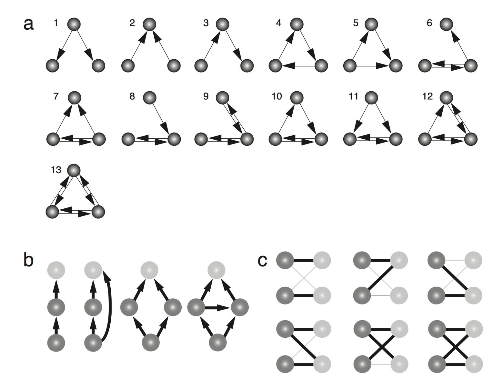
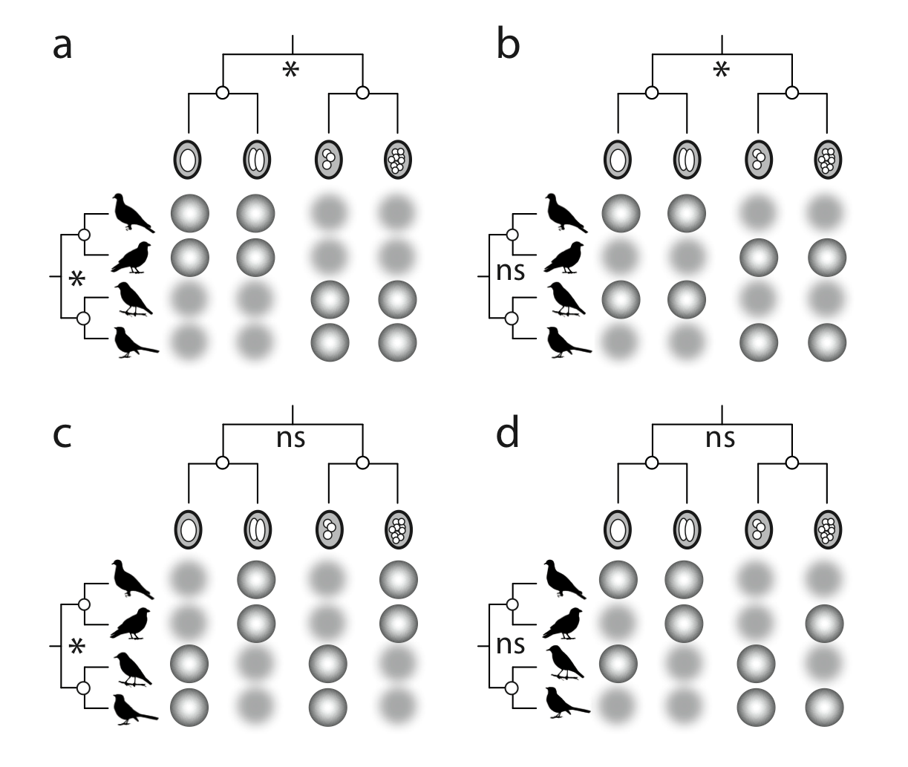
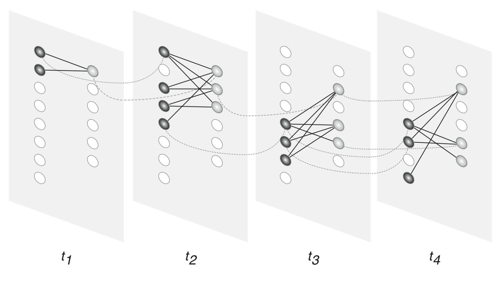

<!-- Generated by fetch-wordpress.py from https://pedrojordano.wordpress.com/2012/04/29/mutualistic-networks-book-sent-to-the-press/ — do not edit by hand. -->

```{=html}
<p><div class="gallery galleryid-205 gallery-columns-3 gallery-size-thumbnail" data-carousel-extra='{"blog_id":14689808,"permalink":"https://pedrojordano.wordpress.com/2012/04/29/mutualistic-networks-book-sent-to-the-press/"}' id="gallery-205-8"><figure class="gallery-item">
<div class="gallery-icon landscape">
<a href="images/fig2-7.png"></a>
</div></figure><figure class="gallery-item">
<div class="gallery-icon landscape">
<a href="images/fig4-8.png"></a>
</div></figure><figure class="gallery-item">
<div class="gallery-icon landscape">
<a href="images/fig5-2.png"></a>
</div></figure>
</div>
</p>
<p>Yes, we sent the book manuscript to Princeton University Press last week. It has been an intensive work during the last four years but I’ve really enjoyed this adventure. I’ve been delighted with the creative work with the figures (around 60), and the challenges of seeting all them in grayscale, which I think is very elegant. We are still waiting for the reviewers’ comments; I hope we succeeded in presenting a simple, yet reasonably complete overview of mutualistic interactions. I’ll keep posting news about how the production stages advance!</p>

```

::: {.wp-original}
Originally published on [my WordPress blog](https://pedrojordano.wordpress.com/2012/04/29/mutualistic-networks-book-sent-to-the-press/).
:::
