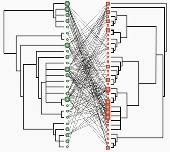

<!-- Generated by fetch-wordpress.py from https://pedrojordano.wordpress.com/2007/05/29/new-paper-in-nature-three-days-ago-we-had-the/ — do not edit by hand. -->

```{=html}
<p></p>
<p><strong>New paper in Nature</strong></p>
<p>Three days ago we had the good news of our manuscript on coextinction cascades in plant-animal mutualistic networks being finally accepted in <a href="http://www.nature.com/nature/index.html" target="_blank">Nature</a>. These are very good news for the group, especially for our efforts in the last 4 years working on complex webs of interactions. Enrico did a superb job leading this ms. Here is the abstract:</p>
<p>Rezende, E., Lavabre, J., Guimarães Jr., P.R., Jordano, P. and Bascompte, J. 2007. Non-random coextinctions in phylogenetically structured mutualistic networks. Nature 00: 000-000.</p>
<p>The interactions between plants and their animal pollinators and seed dispersers have molded much of Earth’s biodiversity. Recently, it has been shown that these mutually beneficial interactions form complex networks with a well-defined architecture that may contribute to biodiversity persistence. Little is known, however, about which ecological, evolutionary, and coevolutionary mechanisms contribute to generate these network patterns. Employing phylogenetic comparative statistical tools, here we show that the evolutionary history of plants and animals significantly predicts the number of interactions per species, and the identity of the species with whom they interact. As a consequence of phylogenetic resemblance on interaction patterns, simulated extinction events tend to trigger coextinction cascades across related species. This results on a non-random pruning of the evolutionary tree and a more pronounced loss of taxonomic diversity than expected in the absence of phylogenetic signal. Our results emphasize how the simultaneous consideration of phylogenetic information and network architecture can contribute to the conservation of species rich communities.</p>

```

::: {.wp-original}
Originally published on [my WordPress blog](https://pedrojordano.wordpress.com/2007/05/29/new-paper-in-nature-three-days-ago-we-had-the/).
:::
