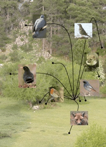

<!-- Generated by fetch-wordpress.py from https://pedrojordano.wordpress.com/2007/03/05/new-paper-in-pnas-just-published-we-have-just/ — do not edit by hand. -->

```{=html}
<p></p>
<p><strong>New paper in PNAS just published</strong></p>
<p>We have just published our paper “Jordano, P., C. García, J.A. Godoy, and J.L. García-Castaño. 2007. Differential contribution of frugivores to complex seed dispersal patterns. <em>Proceedings National Academy of Sciences USA</em>, 104: 3278-3282”. These are great news since it represents a great advance in the analysis of frugivore-created seed shadows. We document the differential contribution of different frugivore groups to seeds dispersed a given distance, using direct assignement procedires based on DNA genotyping methods. At the moment it’s the first approximation we have available to the total dispersal kernel of a plant species. <br/>
The paper has been extensively commented in the ‘Perspectives in Science’ section of <a href="http://www.sciencemag.org/current.dtl" target="_blank">Science</a> journal. Please see the <a href="http://ebd10.ebd.csic.es/mywork/publist.html" target="_blank">publications list</a> for details.</p>

```

::: {.wp-original}
Originally published on [my WordPress blog](https://pedrojordano.wordpress.com/2007/03/05/new-paper-in-pnas-just-published-we-have-just/).
:::
