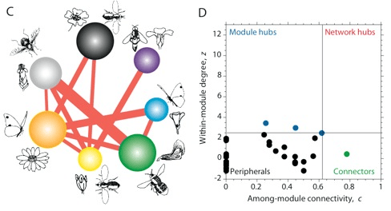

<!-- Generated by fetch-wordpress.py from https://pedrojordano.wordpress.com/2007/12/06/new-paper-in-pnas-we-have-just-published-our/ — do not edit by hand. -->

```{=html}
<p></p>
<p> We have just published our paper “Olesen, J.M., Bascompte, J., Dupont, Y., and Jordano, P. 2007. The modularity of pollination networks. Proceedings of the National Academy of Sciences USA, 104: 19891-19896”. These are great news since it represents a very nice work lead by Jens. Here we relate the concept of moodularity to our previous work on nestedness in mutualistic plant-animal assemblages.</p>

```

::: {.wp-original}
Originally published on [my WordPress blog](https://pedrojordano.wordpress.com/2007/12/06/new-paper-in-pnas-we-have-just-published-our/).
:::
