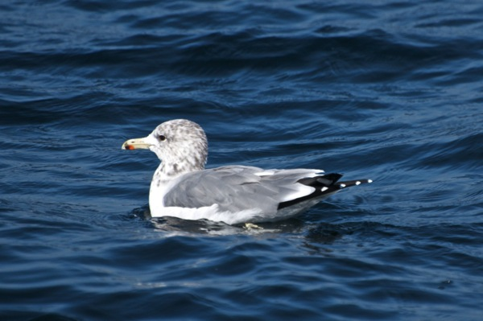
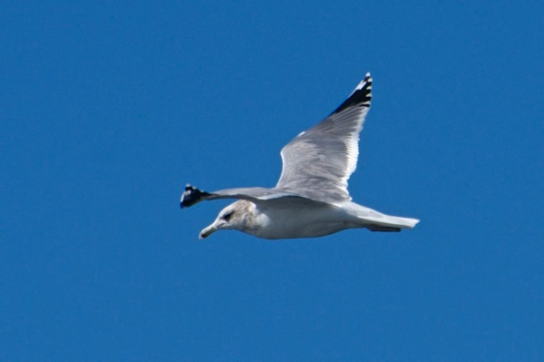
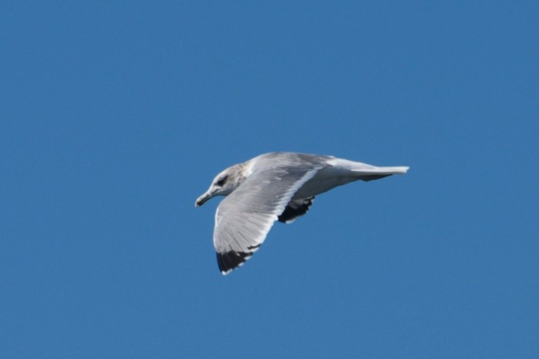
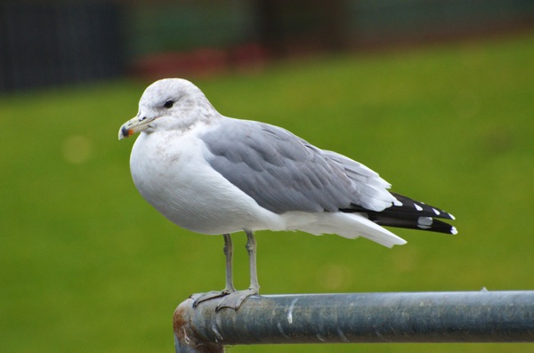
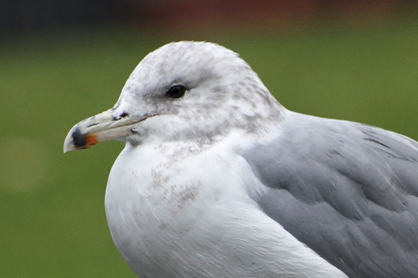
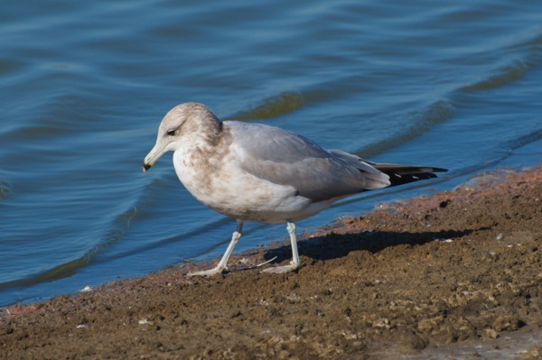
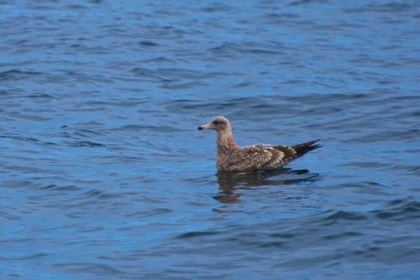

<!-- Generated by fetch-wordpress.py from https://pedrojordano.wordpress.com/2014/01/05/now-the-california-gull-larus-californicus/ — do not edit by hand. -->

```{=html}
<p style="font-size:17px;">This is the California gull, <em>Larus californicus</em> (Lawrence, 1854). It is subs. <em>californicus</em>.</p>
<p style="font-size:17px;"></p>
<p style="font-size:17px;"></p>
<p style="font-size:17px;"></p>
<p style="font-size:17px;">Here we see the white mirrors in P9 and P10, which are characteristic, and the white trailing edge to inner wing. This (both photos of same individual) is an adult (at least 4cy) with the winter plumage (hindneck has dense brown streaks). These first three photos were taken at Wilder Ranch State Park, Santa Cruz, along the coast line.</p>
<p style="font-size:17px;"></p>
<p style="font-size:17px;"></p>
<p style="font-size:17px;">A detail of the wonderful head of this gull (same individual in these two photos, an ad). Note the dark iris, and the color pattern in the bill ring (black with red-orange tinted patch in the lower mandible). The bill is characteristically 4-colored: yellowish at the base, black ring, red-orange dot and ivory tip- this separates it from Ring-billed and Herring. The leg color is also characteristic (green-bluish) but apparently is very variable. I saw other ad birds with very yellow legs. These two photos were taken in San Lorenzo Park, Santa Cruz, CA.</p>
<p style="font-size:17px;"></p>
<p style="font-size:17px;">This is a 3cy bird, finishing molt to 3rd winter. The bill ring is wholly black; there are no white patches on P feathers, nor white mirrors. The bill is longer than in Ring-billed and the head is more massive. The photo was taken at Moss Landing, Elkhorn Slough, CA.</p>
<p style="font-size:17px;"></p>
<p style="font-size:17px;">This is a 1cy bird (juvenile molting into 1st winter plumage), with characteristic black-tipped bill with pale pink in the base. It has not yet started te molt of the scapulars, yet some grayish ones seem to be apparent- the median coverts look worn and faded, creating pale midwing-panel; so the bird is a bit delayed in its molt.</p>
<p style="font-size:17px;">EXIF data:</p>
<p>e_Model NIKON D7000<br/>
e_LensModel AF-S VR Zoom-Nikkor 70-300mm f/4.5-5.6G IF-ED<br/>
e_CameraSerialNumber 6074229<br/>
e_FlashExposureComp 0<br/>
e_ISOSpeedRating 100<br/>
e_ColorModel RGB<br/>
e_Depth 16<br/>
e_FocalLength 300<br/>
e_PixelHeight 3264<br/>
e_ApertureValue 5.6<br/>
e_WhiteBalance 1<br/>
e_ShutterSpeed 0.002<br/>
e_Flash 16<br/>
e_CaptureDayOfMonth 13<br/>
e_CaptureMonthOfYear 10<br/>
e_CaptureYear 2013</p>

```

::: {.wp-original}
Originally published on [my WordPress blog](https://pedrojordano.wordpress.com/2014/01/05/now-the-california-gull-larus-californicus/).
:::
