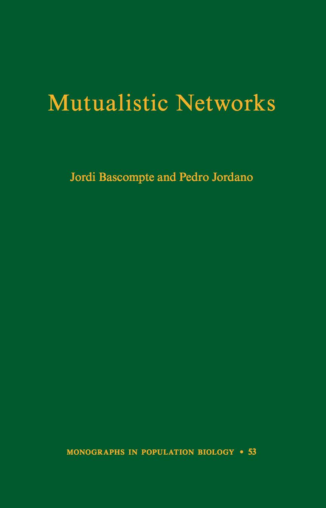

<!-- Generated by fetch-wordpress.py from https://pedrojordano.wordpress.com/2013/12/23/our-new-book-mutualistic-networks-just-published-by-princeton-university-press/ — do not edit by hand. -->

```{=html}
<p><figure aria-describedby="caption-attachment-383" class="wp-caption alignright" data-shortcode="caption" id="attachment_383" style="width: 202px"><a href="images/pup_mutualistic-networks.jpg"></a><figcaption class="wp-caption-text" id="caption-attachment-383">Book cover</figcaption></figure></p>
<p>We have just published our book “<a href="http://press.princeton.edu/titles/10161.html" target="_blank" title="PUP">Mutualistic Networks</a>“, the no. 53 issue in the series Monographs in Population Biology of Princeton University Press.</p>
<p>Mutualistic interactions among plants and animals have played a paramount role in shaping biodiversity. Yet the majority of studies on mutualistic interactions have involved only a few species, as opposed to broader mutual connections between communities of organisms. Our book comprehensively explores this burgeoning field. Integrating different approaches, from the statistical description of network structures to the development of new analytical frameworks, we describe the architecture of these mutualistic networks and show their importance for the robustness of biodiversity and the coevolutionary process.</p>
<p>Making a case for why we should care about mutualisms and their complex networks, we offer a new perspective on the study and synthesis of this growing area for ecologists and evolutionary biologists.</p>

```

::: {.wp-original}
Originally published on [my WordPress blog](https://pedrojordano.wordpress.com/2013/12/23/our-new-book-mutualistic-networks-just-published-by-princeton-university-press/).
:::
