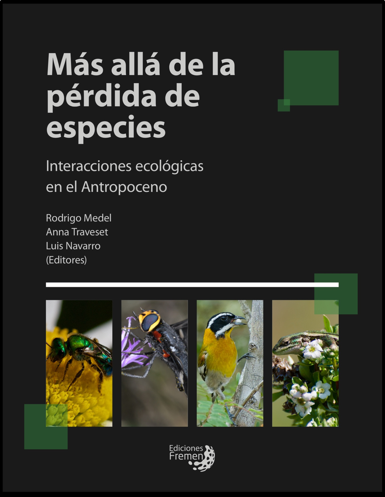

<!-- Generated by fetch-wordpress.py from https://pedrojordano.wordpress.com/2024/09/01/our-new-book-on-ecological-interactions/ — do not edit by hand. -->

```{=html}

<p class="has-text-align-center wp-block-paragraph"></p>
<p class="wp-block-paragraph">We have just published a new book, a fruit of our joint project funded by CYTED, a collaboration of more than 5 Latin American countries and Spain and focusing on the analysis of ecological interactions among species.</p>
<figure class="wp-block-image size-large"></figure>
<p class="wp-block-paragraph">In fact we’ve been collaborating for many years within this and similar projects, so it’s a sustained collaborative work including people from Argentina, Chile, Brazil, Ecuador, Venezuela, Mexico, Spain, Cuba, and Colombia. </p>
<p class="wp-block-paragraph">Our focus is the study of ecological interactions among species and the Biodiversity of interactions: their origins (adaptive radiations) and their extinctions. </p>
<p class="wp-block-paragraph">The book can be downloaded freely from <a href="https://www.academia.edu/122327172/Mas_alla_de_la_Perdida_de_Especies_Interacciones_Ecol%C3%B3gicas_en_el_Antropoceno" rel="noreferrer noopener" target="_blank">here</a>. The full reference is:<br/></p>
<p class="wp-block-paragraph">Medel, R., Traveset, A., Navarro, L. (eds.). 2024. Más allá de la pérdida de especies. Interacciones ecológicas en el Antropoceno. Ediciones Fremen SpA., Santiago de Chile, Chile.<br/>ISBN: 978-956-6191-13-1.</p>

```

::: {.wp-original}
Originally published on [my WordPress blog](https://pedrojordano.wordpress.com/2024/09/01/our-new-book-on-ecological-interactions/).
:::
