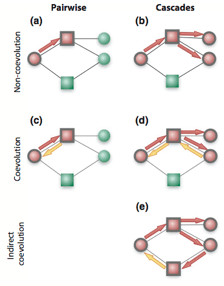

<!-- Generated by fetch-wordpress.py from https://pedrojordano.wordpress.com/2011/08/09/our-new-paper-on-coevolution-in-complex-networks-just/ — do not edit by hand. -->

```{=html}
<p>  Just appeared in the Sept issue of Ecol. Lett. A major current challenge in evolutionary biology is to understand how networks of interacting species shape the coevolutionary process. We combined a model for trait evolution with data for twenty plant-animal assemblages to explore coevolution in mutualistic networks. The results revealed three fundamental aspects of coevolution in species-rich mutualisms. First, coevolution shapes species traits throughout mutualistic networks by speeding up the overall rate of evolution. Second, coevolution results in higher trait complementarity in interacting partners and trait convergence in species in the same trophic level. Third, convergence is higher in the presence of super-generalists, which are species that interact with multiple groups of species. We predict that worldwide shifts in the occurrence of super-generalists will alter how coevolution shapes webs of interacting species. Introduced species such as honeybees will favour trait convergence in invaded communities, whereas the loss of large frugivores will lead to increased trait dissimilarity in tropical ecosystems.<br/>
This is a first attempt to get to models of how coevolved changes might drive the evolution of highly diversified networks of ecological interactions. Each of the interactions that we can map in these networks really represents a set of reciprocal selection forces deriving from the interaction itself. Up to know we were lacking a general theory of how coevolution can proceed in these diversified assemblages, given that these natural selection forces remain diversified, asymmetric and, generally, weak. We show that strictly coevolved changes might in fact be scarce in this scenario, but they trigger cascades of changes that significantly contribute to the evolving network. The work stems on my ongoing collaboration with <a href="http://www.guimaraes.bio.br/" target="_blank">Paulo R. Guimarães</a> and <a href="http://bio.research.ucsc.edu/people/thompson/Thompson.html" target="_blank">John N. Thompson</a>, and the excellent work Paulo developed during his postdoc stay in Sta Cruz at <a href="http://bio.research.ucsc.edu/people/thompson/Index.htm" target="_blank">John’s lab</a>.</p>

```

::: {.wp-original}
Originally published on [my WordPress blog](https://pedrojordano.wordpress.com/2011/08/09/our-new-paper-on-coevolution-in-complex-networks-just/).
:::
