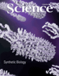

<!-- Generated by fetch-wordpress.py from https://pedrojordano.wordpress.com/2011/09/02/our-new-paper-on-coevolution-in-complex-networks/ — do not edit by hand. -->

```{=html}
<p><a href="http://www.sciencemag.org/content/333/6047/twil.full" target="_blank">  Editor’s Choice</a> section of Science (vol. 333: 1201) this week includes a comment by Andrew Sudgen on <a href="http://onlinelibrary.wiley.com/doi/10.1111/j.1461-0248.2011.01649.x/abstract" target="_blank">our recent paper</a> just published in Ecology Letters. The comment highlights the innovative aspects of studying multispecific coevolution and developing the first model to address the consequences of diversified interactions within complex mutualistic networks.</p>

```

::: {.wp-original}
Originally published on [my WordPress blog](https://pedrojordano.wordpress.com/2011/09/02/our-new-paper-on-coevolution-in-complex-networks/).
:::
