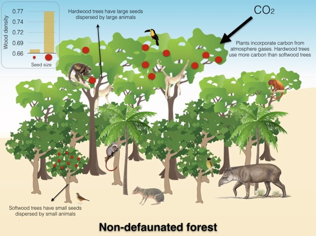
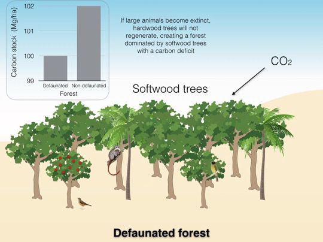

<!-- Generated by fetch-wordpress.py from https://pedrojordano.wordpress.com/2015/12/22/our-paper-on-defaunation-effects-on-carbon-storage-in-tropical-forests/ — do not edit by hand. -->

```{=html}
<p>Plant-animal mutualisms for seed dispersal are key to preserve tropical forests and many other ecosystems (e.g., Mediterranean forests). These interactions may go extinct, and pervasively affect the forests in many aspects. One of them is a substantial loss of carbon storage capacity, simply as a result of collapsed recruitment of large-seeded trees.<br/>
<strong><em><br/>
<a href="http://advances.sciencemag.org/content/1/11/e1501105" target="_blank">Our study</a> shows that the extinction of large animals has negative impacts on climate change.</em></strong></p>
<p>Bello C., Galetti M., Pizo M.A., Magnago L.F.S., Ferreira Rocha M., Lima R.A.F., Peres C.A., Ovaskainen O., and Jordano P. 2015. Defaunation affects carbon storage in tropical forests. <i>Science Advances</i>, 1(11): e1501105. <a href="http://advances.sciencemag.org/content/1/11/e1501105">doi: 10.1126/sciadv.1501105</a></p>
<p></p>
<p><br/>
Defaunation, the severe decline of animal populations from natural ecosystems, is a process faced by tropical forests that can go unnoticed. Several large birds and mammals are threatened by hunting and human persecution. However, the loss of animals can bring about large unforeseen impacts. The extinction of large mammals implies the loss of functions that maintain diversity and ecosystem services on which humans depend.</p>
<p><a href="http://advances.sciencemag.org/content/1/11/e1501105" target="_blank">Our recent study published in the journal Science Advances</a> was conducted by Brazilian researchers from the Universidade Estadual Paulista (São Paulo State University) in Rio Claro, in collaboration with researchers from Spain, England, and Finland, and demonstrated that the loss of large frugivores negatively affects the capacity of tropical forests to stock carbon and, therefore, their potential to counter climate change.</p>
<p>The big frugivores, such as large primates, the tapir, the toucans, among other large animals, are the only ones able to effectively disperse plants that have large seeds. Usually, the trees that have large seeds are big trees with dense wood that store more carbon.</p>
<p><p class="jetpack-slideshow-noscript robots-nocontent">This slideshow requires JavaScript.</p><div class="jetpack-slideshow-window jetpack-slideshow jetpack-slideshow-black" data-autostart="1" data-gallery='[{"src":"https:\/\/pedrojordano.wordpress.com\/wp-content\/uploads\/2015\/12\/abujac.jpg","id":"496","title":"Abujac","alt":"","caption":"Jacutinga (Aburria jacutinga)","itemprop":"image"},{"src":"https:\/\/pedrojordano.wordpress.com\/wp-content\/uploads\/2015\/12\/alouguar.jpg","id":"497","title":"Alouguar","alt":"","caption":"Howler monkey (Alouatta guariba clamitans)","itemprop":"image"},{"src":"https:\/\/pedrojordano.wordpress.com\/wp-content\/uploads\/2015\/12\/braarch.jpg","id":"498","title":"Braarch","alt":"","caption":"Muriqui (Brachyteles arachnoides)","itemprop":"image"},{"src":"https:\/\/pedrojordano.wordpress.com\/wp-content\/uploads\/2015\/12\/tapir.jpg","id":"500","title":"tapir","alt":"","caption":"Anta (Tapirus terrestris)","itemprop":"image"},{"src":"https:\/\/pedrojordano.wordpress.com\/wp-content\/uploads\/2015\/12\/hymenaea.jpg","id":"499","title":"hymenaea","alt":"","caption":"Hymenaea courbaril fruits.","itemprop":"image"},{"src":"https:\/\/pedrojordano.wordpress.com\/wp-content\/uploads\/2015\/12\/coroupita.jpg","id":"502","title":"Coroupita","alt":"","caption":"Coroupita guianensis","itemprop":"image"}]' data-trans="fade" id="gallery-482-2-slideshow" itemscope="" itemtype="https://schema.org/ImageGallery"></div></p>
<p style="text-align:center;"><em>Figure. Large frugivores and large-seeded trees of the Atlantic Forest.</em><em> Mauro Galetti author of the photos a, d, </em><em>and </em><em>e. Pedro Jordano author of photos b, c, and f.</em></p>
<p>When we lose large frugivores we are losing dispersal and recruitment functions of large seeded trees and therefore, the composition of tropical forests changes. The result is a new forest dominated by smaller trees with milder woods which stock less carbon.</p>
<p>Our study showed that when large-seeded trees are removed from the forest and are replaced by trees with smaller seeds, the carbon stock potential of the forest decreases. This is a net result of the seed dispersal and recruitment collapse that entails the large frugivores extinction.</p>
<p><figure aria-describedby="caption-attachment-501" class="wp-caption aligncenter" data-shortcode="caption" id="attachment_501" style="width: 492px"><figcaption class="wp-caption-text" id="caption-attachment-501"><em>Replacement process of tree species composition in tropical forests when they lose large dispersers. Forests with large trees and hardwood (initial community) are replaced by forests with smaller trees with mild wood (final community).</em></figcaption></figure></p>
<p>This is the result of the loss of crucial interactions that support the Web of Life in tropical forests. Not only we are facing the loss of charismatic animals, but we are facing the loss of interactions that maintain the proper functioning and key ecosystem services such as carbon storage. To date, tropical forest degradation has been entirely defined by REDD+ programs in terms of structural forms of human disturbance such as timber extraction and wildfires. Yet, even an apparently intact but otherwise defaunated forest should be considered as degraded because the insidious carbon erosion processes we highlight in this paper are already well underway.</p>
<p>Our study alerts current REDD+ programs that seek to counteract climate change by storing carbon in tropical forests, about the importance of considering the animals and their functionality as a fundamental part of the maintenance of carbon stocks. The effectiveness of these programs will be improved if the preservation of ecological processes that sustain the ecosystem service of carbon storage over time is guaranteed.</p>
<p>The study also included Marco A. Pizo (UNESP), Otso Ovaskainen (University of Helsinki), Renato Lima (USP), Luiz Fernando S. Magnago (Federal University of Lavras) and Mariana Rocha Ferreira (Federal University of Viçosa).</p>

```

::: {.wp-original}
Originally published on [my WordPress blog](https://pedrojordano.wordpress.com/2015/12/22/our-paper-on-defaunation-effects-on-carbon-storage-in-tropical-forests/).
:::
