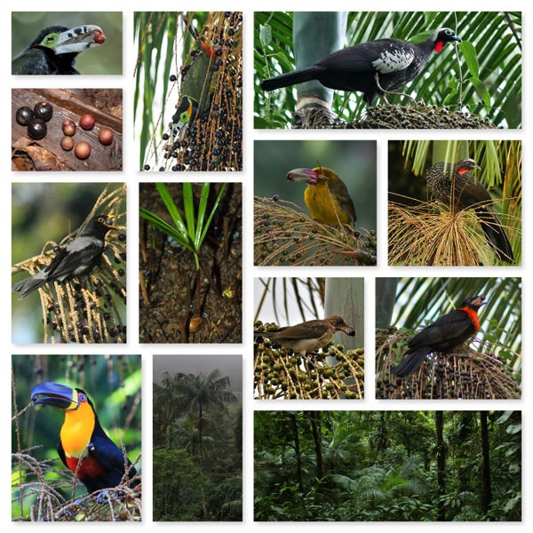
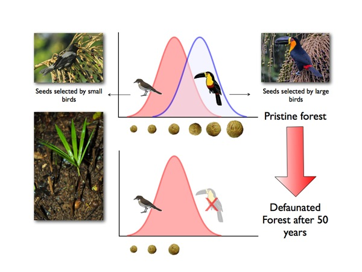

<!-- Generated by fetch-wordpress.py from https://pedrojordano.wordpress.com/2013/05/31/our-study-on-functional-extinction-of-frugivores-published-in-science/ — do not edit by hand. -->

```{=html}
<p>Our new paper “Functional Extinction of Birds Drives Rapid Evolutionary Changes in Seed Size”, just published in this week issue of Science.</p>
<p>Mauro Galetti, Roger Guevara, Marina C. Côrtes, Rodrigo Fadini, Sandro Von Matter, Abraão B. Leite, Fábio Labecca, Thiago Ribeiro, Carolina S. Carvalho, Rosane G. Collevatti, Mathias M. Pires, Paulo R. Guimarães Jr., Pedro H. Brancalion, Milton C. Ribeiro, and Pedro Jordano. 2013. Functional Extinction of Birds Drives Rapid Evolutionary Changes in Seed Size. Science 340: 1086-1090.<br/>DOI: 10.1126/science.1233774.</p>
<p></p>
<h5>Photos, from top left, descending, to right:</h5>
<p>1. <em>Selenidera maculisrotris</em> (male) handling a palmito seed.<br/>2. Palmito fruits with beak marks, dropped beneath the palm, and regurgitated seeds.<br/>3. <em>Turdus flavipes</em> trying to swallow a palmito fruit.<br/>4. <em>Ramphastos vitellinus</em> (subsp. <em>vitellinus</em>) handling a fruit.<br/>5. <em>Selinedera maculirostris</em> (male) picking a fruit.<br/>6. Palmito seedling just after germination (note the seed still attached).<br/>7. Palmito juçara, <em>Euterpe edulis </em>(Arecaceae).<br/>8. <em>Aburria</em> (<em>Pipile</em>) <em>jacutinga</em>.<br/>9. <em>Baillonius</em> (<em>Pteroglossus</em>) <em>bailloni</em> handling a fruit.<br/>10. <em>Turdus amaurochalinus </em>(young), picking a fruit.<br/>11. View of the ompbrphilous atlantic rainfrorest (Mata Atlántica) understory in Carlos Botelho park.<br/>12. <em>Penelope obscura</em>.<br/>13. <em>Pyroderus scutatus</em>, swallowing a fruit.<br/><em>Photos by: Edson Endrigo, Pedro Jordano, Mauro Galetti, Marina Cortes, Guto Balieiro, and Lindolfo Souto.</em></p>
<p>The selective extinction of large frugivorous birds is associated with the rapid evolutionary reduction of seed size in a keystone palm.</p>
<p>Local extinctions have cascading effects on ecosystem functions, yet little is known about the potential for the rapid evolutionary change of species in human-modified scenarios. We show that the functional extinction of large-gape seed dispersers in the Brazilian Atlantic forest is associated with the consistent reduction of seed size of a keystone palm species. Among 22 palm populations, areas deprived of large avian frugivores for several decades present smaller seeds than non-defaunated forests, with negative consequences for palm regeneration. Coalescence and phenotypic selection models indicate that seed size reduction most likely occurred within the last 100 years, associated with human-driven fragmentation. The fast-paced defaunation of large vertebrates is most likely causing unprecedented changes in the evolutionary trajectories and community composition of tropical forests.</p>
<p>When we talk about biodiversity we normally refer to the number of species found in a given area. But these species have ecological functions that are essential to the functioning of ecosystems. The loss of a species also entails the loss of the ecological role it plays in the ecosystem, and this kind of extinction happens much unnoticed. We have documented the effect of functional extinction of large fruit-eating birds on an important plant trait – seed size – of a key plant species of the Atlantic Rainforest in Brazil, one of the biodiversity “hot-spots” on the planet. Our study is a natural experiment that takes advantage of the presence of fragmented areas of forest that have remained so since the early 1800s, when the development of crops such as coffee and sugar cane triggered the extensive deforestation of the Atlantic rainforest. Only 12% of the original forest persists, and over 80% of what remains are fragments are too small to maintain large animals. Our results show that the loss of large fruit-eating birds such as toucans leads to the size reduction of the seeds of a palm tree, which is a key species in these Atlantic forests. These evolutionary changes in fruit and seed size have occurred only in defaunated forests, where only small frugivorous birds persist. These small birds only successfully disperse smaller seeds.</p>
<p></p>
<p>We studied 22 populations of this palm tree along the SE coast of Brazil. In the defaunated areas, which persist as fragments from several decades ago, the seed sizes are consistently smaller than in well-preserved forests, and this has negative consequences for regeneration. The smaller seed size in defaunated areas is not explained by other environmental or geographic variables. Fast natural selection: Small birds such as thrushes cannot swallow and disperse large seeds. Large birds, such as aracaris and toucans, play an important role in dispersing seeds of plants, especially of large seeds. In rainforests without toucans large seeds tend to disappear over time because undispersed seeds are attacked by seed predators. Small seeds are more vulnerable to desiccation and cannot withstand projected climate change.</p>
<p>We have combined a number of techniques including field work, genetic analyses, evolutionary models and statistical analyses. We collected ground data on a large number of palm trees in 22 populations, by collecting fruits, observing the avian frugivore assemblage and conducting germination experiments. We have also used DNA genetic markers to employ quantitative genetic models to estimate the intensity of selection on seed traits and coalescence theoretical models to infer the time of isolation of populations. Finally, we statistically analyzed the effect of different types of data, including climatic and environmental information, on seed size variation. </p>
<p>Our work provides one of the few existing evidence that evolutionary change in natural populations can happen very fast as a direct result of changes induced by human action. The extinction of large vertebrates is happening all over the world and the implication is poorly known. These large bodied species maintain mutualistic interactions with plants: while flesh-fruited plants offer fruits as food sources, frugivores disperse their seeds. Such ecological process ensures natural regeneration of the forest. Unfortunately, the effect we document in our work is probably not an isolated case. The constant extirpation of large vertebrate in natural habitats is very likely causing unprecedented changes in evolutionary trajectories of many tropical species.</p>
<p>Habitat loss and species extinction is causing drastic changes in the composition and structure of ecosystems. This involves the loss of key ecosystem functions that can determine evolutionary changes much faster than we anticipated. Our work highlights the importance of identifying these key functions to quickly diagnose functional collapse of ecosystems.</p>

```

::: {.wp-original}
Originally published on [my WordPress blog](https://pedrojordano.wordpress.com/2013/05/31/our-study-on-functional-extinction-of-frugivores-published-in-science/).
:::
