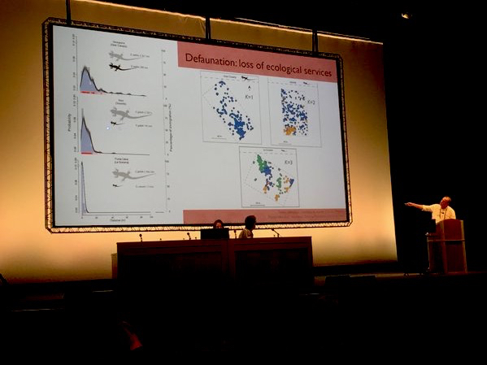

<!-- Generated by fetch-wordpress.py from https://pedrojordano.wordpress.com/2015/12/19/our-symposium-at-the-bes-annual-meeting-2015-2/ — do not edit by hand. -->

```{=html}
<p>A brief great summary of our talks at the <a href="https://storify.com/CoDisperse/importance-of-dispersal-bes2015?utm_medium=sfy.co-twitter&amp;utm_source=t.co&amp;awesm=sfy.co_d0rIU&amp;utm_campaign&amp;utm_content=storify-pingback" target="_blank">British Ecological Society</a> meeting in Edinburgh (UK) this week, by <a href="https://twitter.com/CoDisperse" target="_blank">CoDisperse</a>. <br/>The summary of the tweet feed is <a href="https://storify.com/CoDisperse/importance-of-dispersal-bes2015?utm_medium=sfy.co-twitter&amp;utm_source=t.co&amp;awesm=sfy.co_d0rIU&amp;utm_campaign&amp;utm_content=storify-pingback" target="_blank" title="CoDisperse">here</a>.<br/>This was the thematic topic on Tuesday afternoon, focusing on “Dispersal Processes Driving Plant Movement: Challenges for Range Shifts in a Changing World” and organized by Cristina García, Etienne Klein and myself. Big thanks <a href="https://twitter.com/CoDisperse" target="_blank">CoDisperse</a>!</p>

```

::: {.wp-original}
Originally published on [my WordPress blog](https://pedrojordano.wordpress.com/2015/12/19/our-symposium-at-the-bes-annual-meeting-2015-2/).
:::
