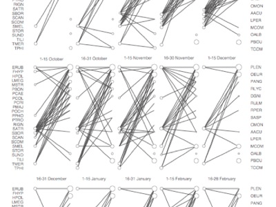

<!-- Generated by fetch-wordpress.py from https://pedrojordano.wordpress.com/2007/11/30/phd-thesis-defense-by-jofre-carnicer-jofre/ — do not edit by hand. -->

```{=html}
<p></p>
<p> Jofre Carnicer defended his thesis at Universitat Auntónoma de Barcelona. The thesis is entitled: “Species richness, interaction networks, and diversification in bird communities: a synthetic ecological and evolutionary perspective”. He addresses large-scale patterns of species diversity and interactions for passerine bird species, taking case studies with the North American avifauna, the bird fauna of Catalonia, and frugivorous birds in SW Spain. The defense went very well and he has already published or has in press manuscripts of several chapters. Congratulations Jofre for an excellent work!</p>

```

::: {.wp-original}
Originally published on [my WordPress blog](https://pedrojordano.wordpress.com/2007/11/30/phd-thesis-defense-by-jofre-carnicer-jofre/).
:::
