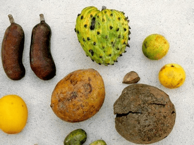

<!-- Generated by fetch-wordpress.py from https://pedrojordano.wordpress.com/2003/07/30/photos-of-megafauna-fruits-go-here-if-you-want-a/ — do not edit by hand. -->

```{=html}
<p></p>
<p><strong>Photos of megafauna fruits</strong></p>
<p>Go here if you want a view of <a href="http://homepage.mac.com/pedroj/PhotoAlbum9.html" target="_blank">megafauna fruits photos</a> . These were taken by Mauro Galetti and me at the Museo Goeldi Herbarium (Belem, Brazil) and correspond to species we analyzed in our ongoing project on megafauna fruits.</p>

```

::: {.wp-original}
Originally published on [my WordPress blog](https://pedrojordano.wordpress.com/2003/07/30/photos-of-megafauna-fruits-go-here-if-you-want-a/).
:::
