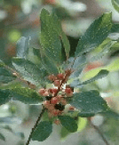

<!-- Generated by fetch-wordpress.py from https://pedrojordano.wordpress.com/2003/07/21/phylogeography-of-frangula-alnus-our-manuscript/ — do not edit by hand. -->

```{=html}
<p></p>
<p><strong>Phylogeography of <em>Frangula alnus</em></strong></p>
<p>Our manuscript “Hampe, A., J. Arroyo, P. Jordano, and R.J. Petit. 2003. Rangewide phylogeography of a bird-dispersed Eurasian shrub: contrasting Mediterranean and temperate glacial refugia” is now tentatively accepted for <em>Molecular Ecology</em> vol. 12, pending minor changes.</p>

```

::: {.wp-original}
Originally published on [my WordPress blog](https://pedrojordano.wordpress.com/2003/07/21/phylogeography-of-frangula-alnus-our-manuscript/).
:::
