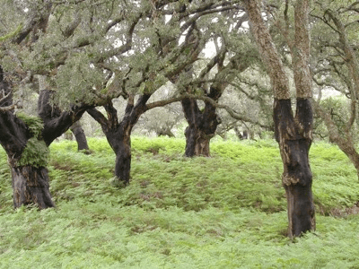

<!-- Generated by fetch-wordpress.py from https://pedrojordano.wordpress.com/2007/01/13/pre-doctoral-grant-available-la-convocatoria-de/ — do not edit by hand. -->

```{=html}
<p></p>
<p><strong>Pre-doctoral grant available</strong></p>
<p>La convocatoria de ayudas para becas predoctorales FPI está próxima a ser publicada por el MEC.</p>
<p>Dentro de nuestro proyecto “DISPERSIÓN DE SEMILLAS POR ANIMALES FRUGÍVOROS: EVENTOS A LARGA DISTANCIA Y REDES DE CONECTIVIDAD EN POBLACIONES FRAGMENTADAS” (CGL2006-00373), estamos interesados en recibir candidaturas para una beca FPI del MEC para desarrollar una Tesis doctoral.</p>
<p>En plantas en las que los animales influyen directamente en el flujo génico via polen y semillas, la variabilidad genética aparece fuertemente estructurada a diferentes escalas espaciales. El mantenimiento de esta estructura espacial se basa en la conectividad entre poblaciones via polen y semillas, distribuidas por animales mutualistas. En escenarios de fragmentados es esencial comprender cómo se estructura esta conectividad a fin de poder predecir los efectos de pérdida (extinción local) de poblaciones y limitación de los procesos de dispersión. En este proyecto abordamos estos aspectos centrándonos en especies forestales amenazadas o relictas, para las cuales ya disponemos de información a raíz de proyectos anteriores. En esta propuesta abordamos el problema de la persistencia de las poblaciones de estas especies basándonos en una mejor comprensión de la conectividad que existe entre ellas y de la dependencia de animales polinizadores y frugívoros para el reclutamiento. Nos centraremos en <em>Olea europaea</em> var. <em>sylvestris</em>, y abordaremos también aspectos demográficos y genéticos en <em>Frangula alnus</em>, <em>Laurus nobilis</em>, y <em>Prunus mahaleb</em>. Nuestra propuesta sintetiza las principales líneas de trabajo que mantiene nuestro grupo y aborda cuestiones clave sobre la preservación de la biodiversidad de especies, interacciones y acervo genético en escenarios de cambio ambiental. El enfoque es interdisciplinar, aunando diferentes aproximaciones (análisis estadístico de bases de datos, teoría de redes complejas, métodos de genética molecular y simulaciones de ordenador).</p>
<p>El trabajo de tesis se centraría en los aspectos de conectividad en poblaciones fragmentadas. Perfil requerido: formación en biología y/o ciencias ambientales con un buen expediente académico. Se valorarán positivamente los conocimientos en ecología, genética molecular y estadística, con una fuerte motivación e interés por estos temas. Se requiere inglés hablado/escrito con nivel alto. El trabajo previsto incluye tareas de campo y de laboratorio.</p>
<p>Las bases de la convocatoria serán publicadas próximamente por el MEC (ver <a href="http://www.mec.es/ciencia/jsp/plantilla.jsp?area=becasfpi&amp;id=11" target="_blank"><a href="http://www.mec.es/ciencia/jsp/plantilla.jsp?area=becasfpi&amp;id=11" target="_blank">http://www.mec.es/ciencia/jsp/plantilla.jsp?area=becasfpi&amp;id=11</a></a> para convocatorias anteriores).</p>
<p>Las personas interesadas deben ponerse en contacto lo antes posible con Pedro Jordano  adjuntando su CV actualizado (con datos de contacto) junto con copia de su expediente académico. El plazo de la convocatoria, que se publicará en BOE en breve, será sólo de unos 15 días. Más información sobre el grupo de investigación y sobre nuestro trabajo se puede encontrar en las páginas web:<br/>
<a href="http://ebd10.ebd.csic.es" target="_blank">http://ebd10.ebd.csic.es</a>&gt;<br/>
<a href="http://ieg.ebd.csic.es" target="_blank">http://ieg.ebd.csic.es</a>&gt;</p>

```

::: {.wp-original}
Originally published on [my WordPress blog](https://pedrojordano.wordpress.com/2007/01/13/pre-doctoral-grant-available-la-convocatoria-de/).
:::
