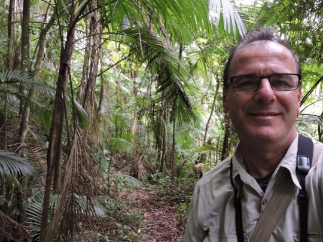

<!-- Generated by fetch-wordpress.py from https://pedrojordano.wordpress.com/2014/05/12/rey-jaime-i-award-environmental-sciences/ — do not edit by hand. -->

```{=html}
<p><a href="//localhost//Users/pedro/Library/Caches/com.blogo.Blogo.nonmas/1451305579_thumb.jpeg" target="_blank"></a><br/> </p>
<p>I’m very honored with being awarded the <a href="http://www.fvea.es/noticiapj108.html">Rey Jaime I Award in Environmental Sciences</a> this year. I was surprised with the decision of the jury during my stay in Brazil during this year’s Ciência Sem Fronteiras stay. It was great to have many, many messages with support and congratulations from many colleagues. My sincere thanks to all them!</p>
<p>I’m very happy with the award, as it aids supporting conservation efforts in the natural areas where I do my field work: Cazorla, Doñana, Alcornocales, Islas Canarias.</p>

```

::: {.wp-original}
Originally published on [my WordPress blog](https://pedrojordano.wordpress.com/2014/05/12/rey-jaime-i-award-environmental-sciences/).
:::
