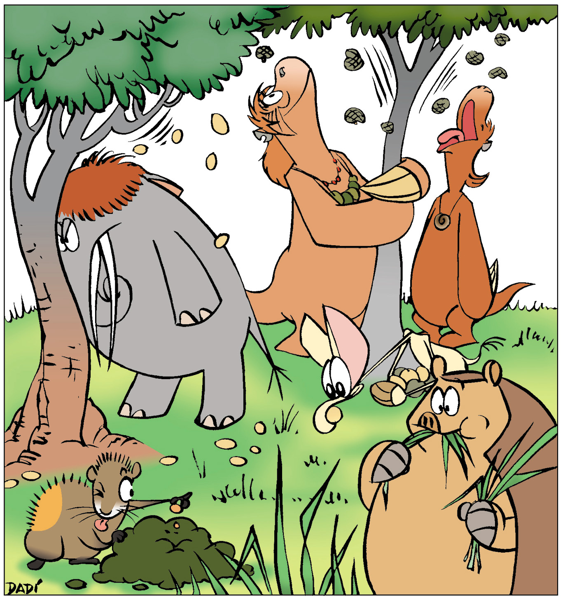

<!-- Generated by fetch-wordpress.py from https://pedrojordano.wordpress.com/2016/12/16/seed-dispersal-by-megafauna-extinct-and-extant/ — do not edit by hand. -->

```{=html}
<p>I’ll be posting a series on megafauna (extinct and extant) and megafauna-dependent plants that I’ve been contributing to our <a href="https://www.facebook.com" target="_blank">Facebook</a> page <a href="https://www.facebook.com/FSD2020/" target="_blank">Frugivores &amp; Seed Dispersal</a> during the month of December. The posts focused on megafauna frugivores and megafauna-dependent fruits and seeds, and the processes of dispersal associated with them. I also included other interesting posts on frugivory and seed dispersal, as ever, but megafauna was the focus. Hopefully we contribute to a better appreciation of the distinct ecological roles and the contribution of megafauna species to the functioning and maintenance of ecosystems around the world, specifically on their role as frugivores and seed dispersers.</p>
<p></p>
<p>Among the most spectacular frugivores and seed dispersers we find the Megafauna species, those amazing beasts that impress every naturalist because of their adaptations, life histories, and specific traits. Yet megafauna species are being particularly hard hit by human-driven activities, notably hunting and deforestation. Megafauna species are traditionally defined as being above 40 kg body mass (i.e., &gt; 100 lb), and include a full range of mammals (e.g., rhino, elephants, a number of antelopes, large primates), birds (e.g., ostrich, cassowary, emu), and reptiles (e.g., varanids, turtles). Moreover, think about the late Pleistocene (~12 Kyr BP) extinction of an even richest diversity of megafauna species: toxodons, terrestrial sloths, mamuths, gliptodons, gomphoteres, etc. The study of frugivory and seed dispersal (FSD) by megafauna opens a number of extremely interesting questions, ranging from the role of past history in shaping fruit traits, the lasting signatures of past extinctions of major seed dispersers for plants (e.g., in the genetic pools), the conflicts and interactions with humans in natural and seminatural habitats, the role of extremely long-distance seed dispersal by megafauna and its collapse following extinction, etc.</p>
<p>Illustration: Dadi, “Cada um”.</p>
<p> </p>

```

::: {.wp-original}
Originally published on [my WordPress blog](https://pedrojordano.wordpress.com/2016/12/16/seed-dispersal-by-megafauna-extinct-and-extant/).
:::
