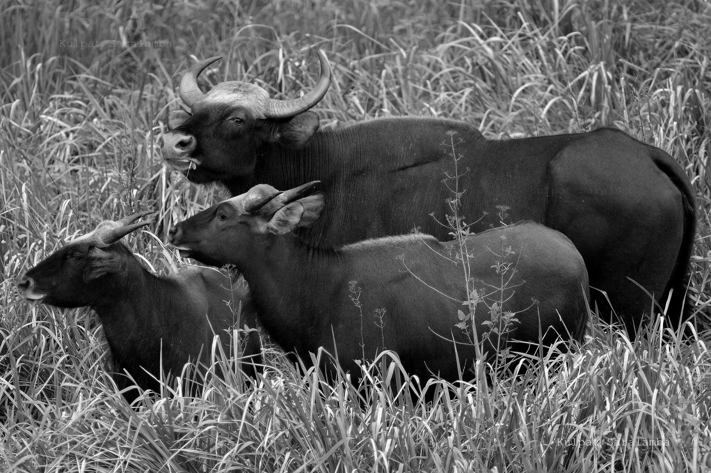

<!-- Generated by fetch-wordpress.py from https://pedrojordano.wordpress.com/2016/12/23/the-cryptic-extinctions/ — do not edit by hand. -->

```{=html}
<p>McConkey, K.R. &amp; O’Farrill, G. (2016) Loss of seed dispersal before the loss of seed dispersers. Biological Conservation, 201, 38–49.</p>
<p>Cryptic function loss is a loss in the function of a species that is hidden by its continued presence in the ecosystem; the species may still be present and showing up in a biodiversity inventory, yet its functional ecological role has disappeared. <span class="text_exposed_show"><br/>
The authors reviewed the evidence for cryptic function loss to be widespread among seed disperser populations that persist under disturbed conditions. The results overwhelming support for the seed dispersal effectiveness of animals to be negatively impacted by all forms of disturbance (population decline, changes in community assemblages, habitat change, and climate change). However, seed dispersal was positively affected in some examples, particularly when extirpation of an interacting frugivore or predator enhanced fruit consumption. </span></p>
<p><figure aria-describedby="caption-attachment-581" class="wp-caption aligncenter" data-shortcode="caption" id="attachment_581" style="width: 850px"><a href="images/gaur3.jpg"></a><figcaption class="wp-caption-text" id="caption-attachment-581">A group of gaurs (Bos gaurus) (also known as Indian bison); a species listed as vulnerable on the IUCN Red List since 1986. The population decline in parts of the species’ range is likely to be well over 70% during the last three generations. Photo: Kulpat Saralamba.</figcaption></figure></p>
<p><span class="text_exposed_show"> Behavioral changes are usually the first adaptation of an animal to disturbance and are likely to be a common trigger for function loss without species loss, resulting in the animal no longer performing a function carried out previously. Substantial decrease in population density or demography of an animal species can also trigger cryptic function loss; for example, when specialization occurs among individuals within a single population and a non-random subset of individuals is particularly vulnerable to a disturbance. Finally, cryptic function loss can occur through phenotypic adaptation of an animal species, when the physical alteration enhances survival but is not matched by interacting species.<br/>
Given the ample generalization shown by many seed dispersal systems, we are far from understanding the consequences of functional losses due to population density collapses of frugivore species triggered by disturbances. In Dan Janzen’s words, this is the most pervasive kind of extinction, the extinction of interactions.</span></p>
<div class="text_exposed_show">
<p>See also:<br/>
– Jarić, I., 2015. Complexity and insidiousness of cryptic function loss mechanisms. Trends in Ecology and Evolution 30, 371–372.<br/>
– Valiente-Banuet, A., Aizen, M.A., Alcántara, J.M., Arroyo, J., Cocucci, A., Galetti, M., García, M.B., García, D., Gomez, J.M., Jordano, P., Medel, R., Navarro, L., Obeso, J.R., Oviedo, R., Ramírez, N., Rey, P.J., Traveset, A., Verdú, M., Zamora, R., 2015. Beyond species loss: the extinction of ecological interactions in a changing world. Functional Ecology 29, 299–307.</p>
<p>Text: Excerpts from McConkey, K.R. &amp; O’Farrill, G. 2016; and Pedro Jordano. Photo: Kulpat Saralamba.</p>
</div>

```

::: {.wp-original}
Originally published on [my WordPress blog](https://pedrojordano.wordpress.com/2016/12/23/the-cryptic-extinctions/).
:::
