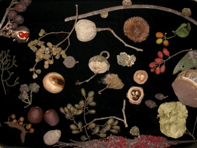

<!-- Generated by fetch-wordpress.py from https://pedrojordano.wordpress.com/2010/06/21/the-frugivory-and-seed-dispersal-meeting-was/ — do not edit by hand. -->

```{=html}
<p></p>
<p>The frugivory and seed dispersal meeting was organized this year in Montpellier, France. FSD2010 entitled “Frugivores and Seed Dispersal: Mechanisms and Consequences of a Key Interaction for Biodiversity”. It has been quite a success. We are preparing a ‘meeting report’ paper for Biology Letters, and the plenary talks will be published in a special issue of Acta Oecologica. I’ll update the info here…</p>
<p>Photo: K. Holbrook</p>

```

::: {.wp-original}
Originally published on [my WordPress blog](https://pedrojordano.wordpress.com/2010/06/21/the-frugivory-and-seed-dispersal-meeting-was/).
:::
