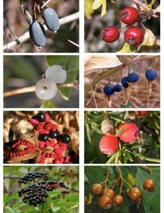

<!-- Generated by fetch-wordpress.py from https://pedrojordano.wordpress.com/2012/06/16/updated-dataset-on-fruit-colors-in-dryad/ — do not edit by hand. -->

```{=html}
<p>  I’ve updated our dataset on fruit colors that we used in the Journal of Evolutionary Biology paper. The full metadata is <a href="http://datadryad.org/resource/doi:10.5061/dryad.8011?show=full" title="http://datadryad.org/resource/doi:10.5061/dryad.8011?show=full">here</a>, in the <a href="http://datadryad.org/" target="_blank" title="Dryad">Dryad</a> open-source repository. You can find this and other datasets also in the <a href="http://ebd10.ebd.csic.es/ebd10/Datasets.html" target="_blank" title="Datasets at Pedro Jordano Lab">web page</a>.</p>

```

::: {.wp-original}
Originally published on [my WordPress blog](https://pedrojordano.wordpress.com/2012/06/16/updated-dataset-on-fruit-colors-in-dryad/).
:::
