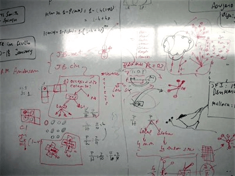

<!-- Generated by fetch-wordpress.py from https://pedrojordano.wordpress.com/2006/10/22/visits-to-ieg-we-had-a-number-of-visits-at-ieg/ — do not edit by hand. -->

```{=html}
<p></p>
<p><strong>Visits to IEG</strong></p>
<p>We had a number of visits at IEG during September and the first half of October: Andy Jones (at STRI, Panama), and Sabrina Russo (Univ. Cambridge, UK), <a href="http://genetics.biology.kyushu-u.ac.jp/pgen/staff/ys.htm" target="_blank">Yoshihisa Suyama</a> and <a href="http://motoshi.tk/?Profile" target="_blank">Motoshi Tomita</a> (Tohoku Univ, Japan). Also we had Margarita Rios, from Colombia (Fundación Ecoandina y Wildlife Conservation Society) for a short stay at the lab. In addition Paulo came for a short stay.</p>

```

::: {.wp-original}
Originally published on [my WordPress blog](https://pedrojordano.wordpress.com/2006/10/22/visits-to-ieg-we-had-a-number-of-visits-at-ieg/).
:::
