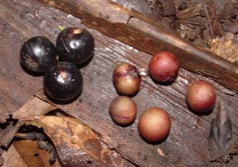

---

+ [DOI: 10.1111/2041-210X.12212](https://doi.org/10.1111/2041-210X.12212)

---

##### Citation

[](/pdfs/Gonzalez-Varo_Arroyo_Jordano_2014_MEE.pdf) 131. González-Varo, J.P., Arroyo, J.M., and Jordano, P. 2014. Who dispersed the seeds? The use of DNA barcoding in frugivory and seed dispersal studies. *Methods in Ecology and Evolution* 5: 806–814. doi: 10.1111/2041-210X.12212

```latex
@article{RN4876,
   author = {González‐Varo, Juan P. and Arroyo, Juan M. and Jordano, Pedro},
   title = {Who dispersed the seeds? The use of DNA barcoding in frugivory and seed dispersal studies},
   journal = {Methods in Ecology and Evolution},
   volume = {5},
   number = {8},
   pages = {806–814},
   abstract = {1. Assessing dispersal events in plants faces important challenges and limitations. A methodological issue that limits advances in our understanding of seed dissemination by frugivorous animals is identifying ‘which species dispersed the seeds’. This is essential for assessing how multiple frugivore species contribute distinctly to critical dispersal events such as seed delivery to safe sites, long-distance dispersal and the colonization of non-occupied habitats. 2. Here,we describe DNA-barcoding protocols successfully applied to bird-dispersed seeds sampled in the field. AvianDNAwas extracted from the surface of defecated or regurgitated seeds, allowing the identification of the frugivore species that contributed each dispersal event. Disperser species identification was based on a 464-bp mitochondrialDNAregion (COI: cytochrome c oxidase subunit I). 3. We illustrate the possible applications of this method with bird-dispersed seeds sampled in the field. DNA-barcoding provides a non-invasive technique that allows quantifying frugivory and seed dispersal interac- tion networks, assessing the contribution of each frugivore species to seed rain in different microhabitats, and testingwhether different frugivore species select different fruit/seed sizes. 4. DNA barcoding of animal-dispersed seeds can resolve the distribution of dispersal services provided by diverse frugivore assemblages, allowing a robust and precise estimation of the different components of seed dis- persal effectiveness, previously unattainable to traditional field studies at individual seed level. Given that seeds are sampled at the end of the dispersal process, this technique enables us to link the identity of the disperser spe- cies responsible for each dispersal event to plant traits and environmental features, thereby building a bridge between frugivory and seed deposition patterns.},
   keywords = {Frugivores
Endozoochory
Microhabitats
Barcode of life data system
COI region
Fruit size selection
Interaction network
Mediterranean woodland
Seed deposition patterns},
   ISSN = {2041-210X},
   DOI = {10.1111/2041-210X.12212},
   year = {2014},
   type = {Journal Article}
}

```

---

##### Figure



