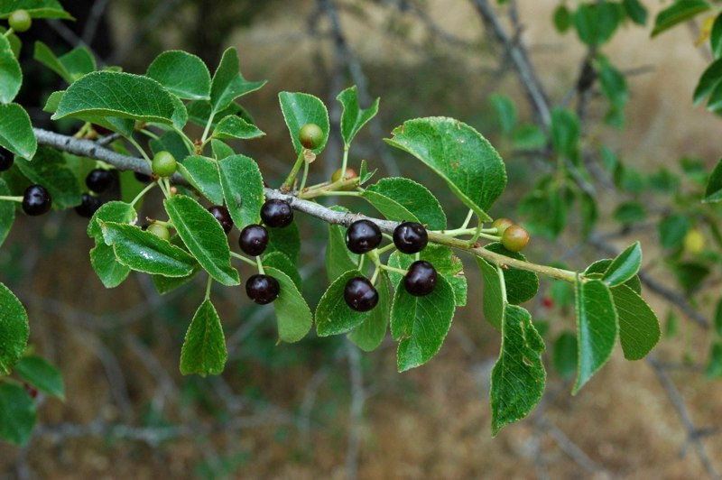
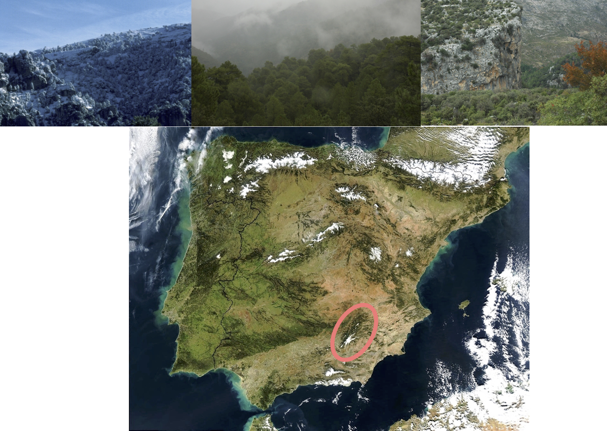
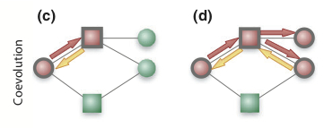
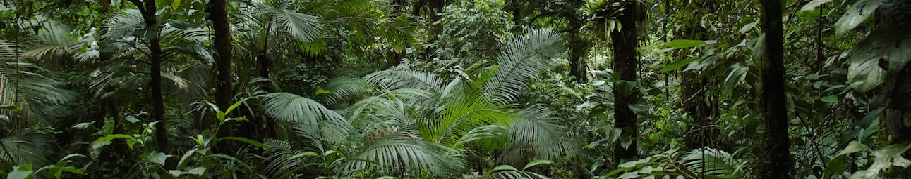
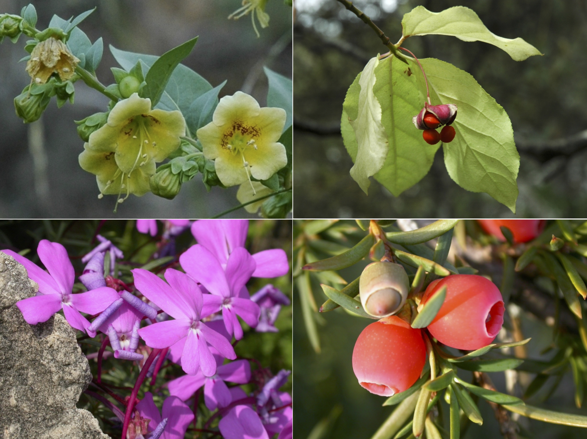
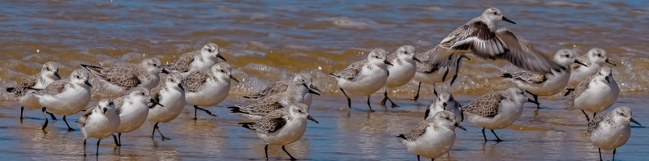
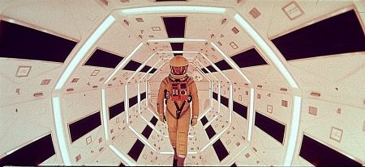
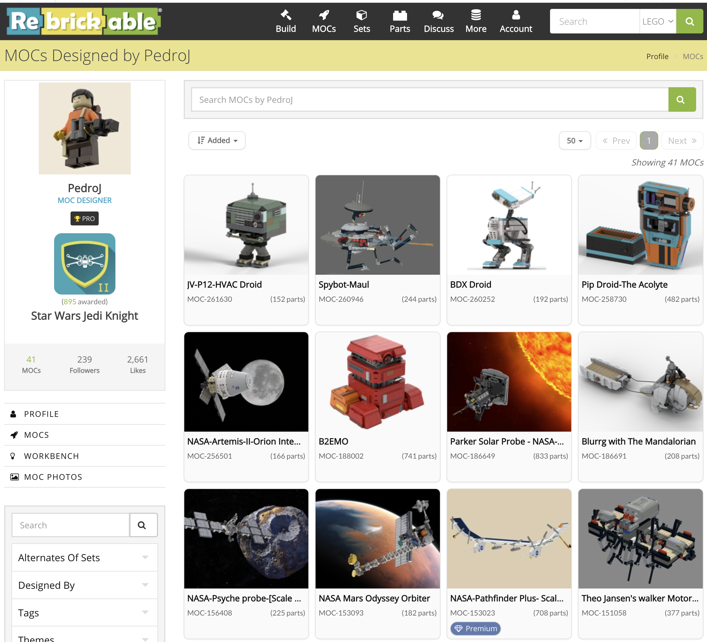
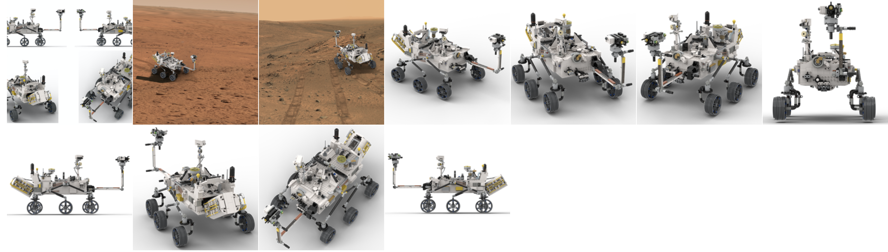

{fig-align="center"}

Photographs from our study systems, field sites and lab. Click any image to open
it full size; camera details and capture date come from the files' own EXIF
metadata.

::: panel-tabset
## Megafauna fruits

](static/images/banners/banner77.jpg){fig-align="center"}



## Prunus mahaleb

{fig-align="center"}



## Study sites

{fig-align="center"}

### Los Alcornocales



### Las Correhuelas



### Nava de las Correhuelas / Guadahornillos



### Doñana

Photographs for this gallery are not online yet. Drop JPEGs into
`photos/study-sites/donana/` and they will appear on the next render.

### Islas Canarias

Photographs for this gallery are not online yet. Drop JPEGs into
`photos/study-sites/canarias/` and they will appear on the next render.

## Networks

{fig-align="center" width="100%"}



## Brazil

{fig-align="center"}



## The lab



## Fruits, flowers

{fig-align="center"}



## Birds

{fig-align="center"}



## Art

{fig-align="center" width="100%"}



## LEGO

{fig-align="center"}

Here are some of my LEGO creations. You can find more details in my
[Rebrickable](https://rebrickable.com/users/PedroJ/mocs/) ,
[Bricklink](https://www.bricklink.com/v3/studio/public_gallery.page?idUser=722691 "Bricklink"),
and [Bricksafe](https://bricksafe.com/home "Bricksafe") repositories. Mostly I
build Star Wars droids and anything related, NASA spacecrafts, and robots.

{fig-align="center"}

{fig-align="center"}

E.g., this one below is my version of the [**NASA Mars Rover 2020 Perseverance,
Scale 1:10 with Ingenuity
copter**](https://rebrickable.com/mocs/MOC-81801/PedroJ/nasa-mars-rover-2020-perseverance-scale-110-with-ingenuity-copter/#details "NASA Mars Rover 2020 Perseverance")**.**
:::

{fig-align="center"}