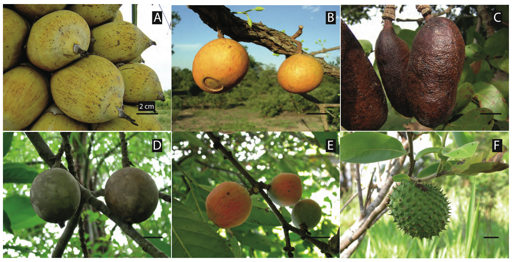

{fig-align="center"}

Photographs from our study systems, field sites and lab. Click any image to open
it full size; camera details and capture date come from the files' own EXIF
metadata.

::: panel-tabset
## Megafauna fruits

{fig-align="center"}



## Prunus mahaleb

{fig-align="center"}



## Study sites

{fig-align="center"}

### Los Alcornocales



### Las Correhuelas



### Nava de las Correhuelas / Guadahornillos



### Doñana

Photographs for this gallery are not online yet. Drop JPEGs into
`photos/study-sites/donana/` and they will appear on the next render.

### Islas Canarias

Photographs for this gallery are not online yet. Drop JPEGs into
`photos/study-sites/canarias/` and they will appear on the next render.

## Networks

{fig-align="center" width="100%"}



## Brazil

{fig-align="center"}



## The lab



## Fruits, flowers

{fig-align="center"}



## Birds

{fig-align="center"}



## Art

{fig-align="center" width="100%"}



## LEGO

{fig-align="center"}

Here are some of my LEGO creations. You can find more details in my
[Rebrickable](<https://rebrickable.com/users/PedroJ/mocs/>) repository.

{fig-align="center"}
:::
