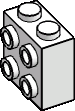

{.hero-banner fig-align="center"
width="100%"}

:::::: {.grid .hero-grid}
::: {.g-col-12 .g-col-sm-4 .hero-photo-col}
{.hero-headshot
fig-align="center"}
:::

:::: {.g-col-12 .g-col-sm-8 .hero-bio-col}
```{=html}
<p class="hero-affiliation">Research Professor, Estación Biológica de Doñana, CSIC, and Assoc. Professor, Univ. Sevilla</p>
<h1 class="hero-name">Pedro Jordano</h1>
<p class="hero-bio">My research focuses on the study of biological diversity (biodiversity) from both ecological and evolutionary perspectives. I am interested in how ecological interactions, e.g. mutualisms, shape complex ecological systems. Interactions, such as those among plants and their seed dispersers and pollinators, are the wireframe of biodiversity, yet we are far from understanding how they evolve and coevolve. My main research tools to address this fascinating theme include field ecology, molecular genetics, and theoretical ecology.</p>
```

• [More details →](pedro.qmd)

--------------------------------------------------------------------------------

::: research-chips
|  |  |
|:-----------------------:|-------------------------------------------------------|
| {width="50%"} | Ecology • Conservation Biology • Complex networks • Ecological interactions • Biodiversity • Tropical ecology • Mutualisms • Plant-animal interactions • Dispersal and gene flow |
:::

```{=html}
<div class="hero-cta">
  <a href="research.html" class="btn-primary-custom">
    <i class="bi bi-journal-text"></i> Publications
  </a>
  <a href="cv/cv.pdf" class="btn-outline-custom" target="_blank">
    <i class="bi bi-file-earmark-person"></i> Download CV
  </a>
  <a href="mailto:jordano@ebd.csic.es" class="btn-outline-custom">
    <i class="bi bi-envelope"></i> Contact
  </a>
</div>
```
::::
::::::

<hr class="section-divider">

##  Recent Work {.section-heading}

[All publications →](research.qmd){.section-link}

::: {#articles}
:::