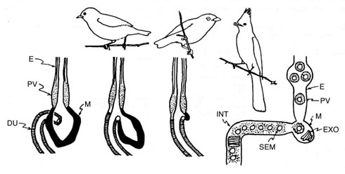
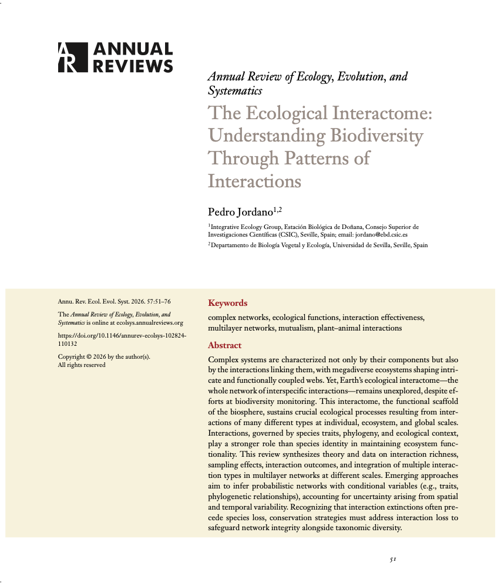
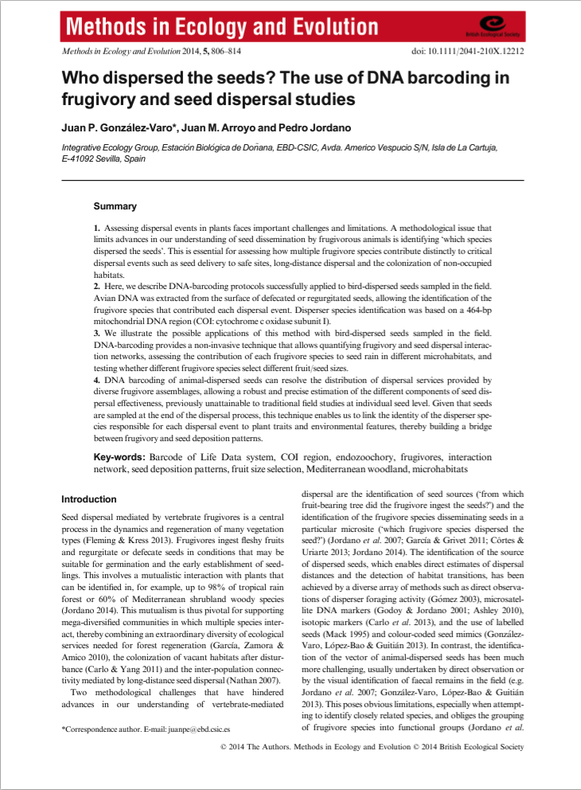
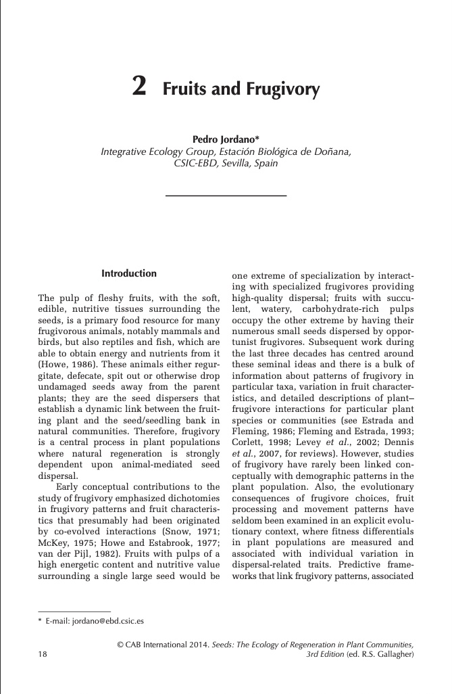
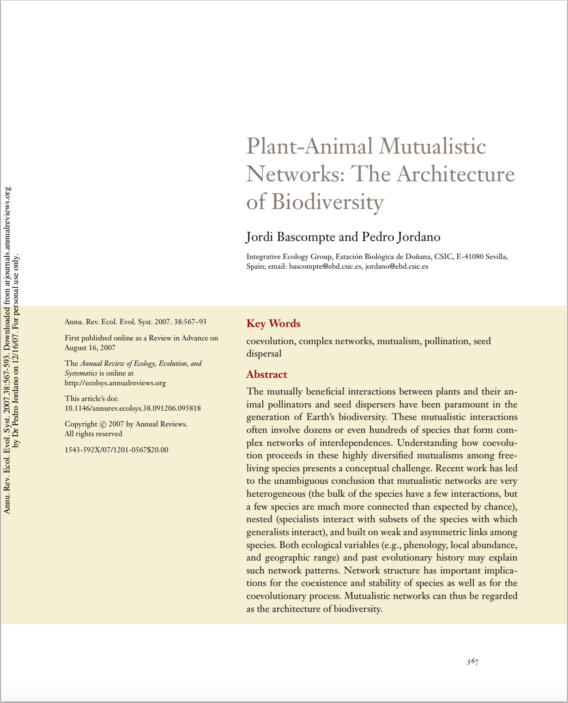
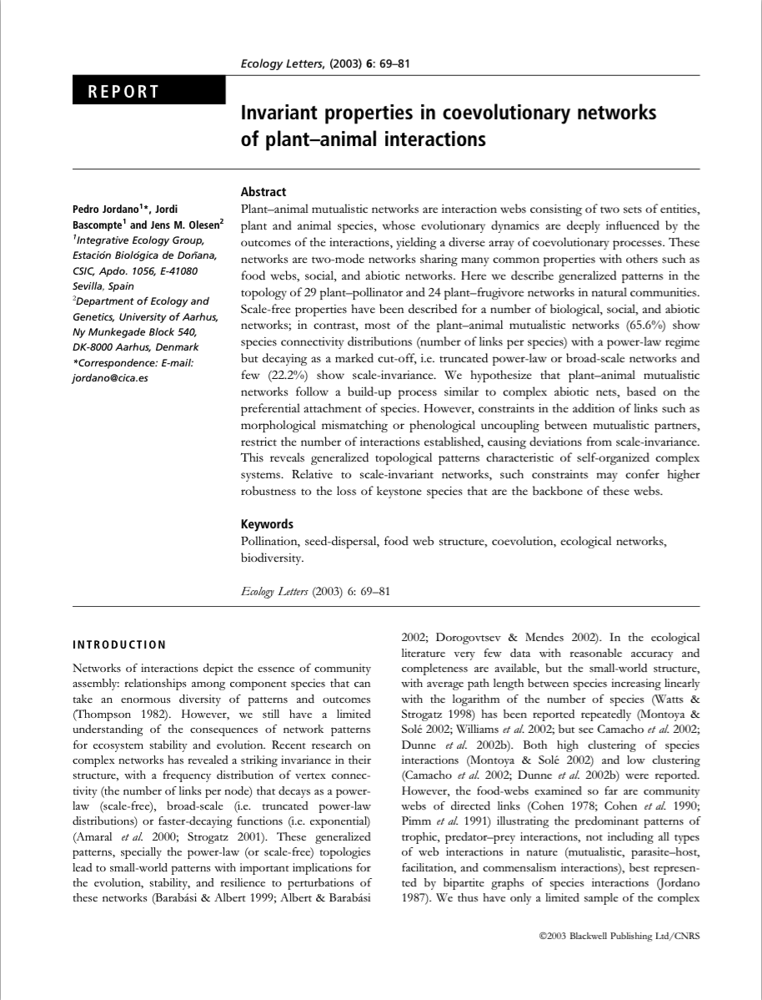
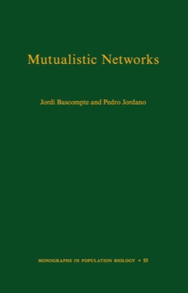

::::: profile-grid
::: profile-photo
{fig-alt="Pedro Jordano"}
:::

::: profile-bio
My research focuses on the study of biological diversity (biodiversity) from
both ecological and evolutionary perspectives. I am interested in how ecological
interactions, e.g. mutualisms, shape complex ecological systems. Interactions,
such as those among plants and their seed dispersers and pollinators, are the
wireframe of biodiversity, yet we are far from understanding how they evolve and
coevolve. My main research tools to address this fascinating theme include field
ecology, molecular genetics, and theoretical ecology.

[Summary CV](http://PJordano-Lab.ebd.csic.es/markdown/ "CV") · [Google
Scholar](https://scholar.google.es/citations?user=TrKYqaEAAAAJ&hl=en) ·
[ResearchGate](https://www.researchgate.net/profile/Pedro_Jordano) ·
[WordPress](https://pedrojordano.wordpress.com/) ·
[\@pedro_jordano](https://twitter.com/pedro_jordano) ·
[GitHub](http://github.com/pedroj)
:::
:::::

[{fig-alt="Papers by Pedro Jordano"}](research.html)

### [Papers — Pedro Jordano](research.html "Papers_Pedro")

--------------------------------------------------------------------------------

### Highlighted papers

::: paper-row
[{fig-alt="First page of Jordano 2026"}](static/images/papers_covers/AREES_2026_Interactome.png)

Jordano, P. (2026). The ecological interactome: understanding Biodiversity
through patterns of interactions. Annual Review of Ecology, Evolution, and
Systematics, 57, 51–76.\
doi:
[10.1146/annurev-ecolsys-102824-110132](https://doi.org/10.1146/annurev-ecolsys-102824-110132)
:::

::: paper-row
[{fig-alt="First page of González-Varo et al. 2014"}](static/images/papers_covers/MolEcol_2014_Who-dispersed.png)

González-Varo, J.P., Arroyo, J.M., and Jordano, P. 2014. Who dispersed the
seeds? The use of DNA barcoding in frugivory and seed dispersal studies.
*Methods in Ecology and Evolution* 5: 806–814.\
doi: [10.1111/2041-210X.12212](https://doi.org/10.1111/2041-210X.12212)
:::

::: paper-row
[{fig-alt="First page of Jordano 2014"}](static/images/papers_covers/CABI_2014_Fruits_frug.png)

Jordano, P. (2014). Fruits and frugivory. In: Seeds: the ecology of regeneration
in plant communities (ed. Gallagher, RS). Commonwealth Agricultural Bureau
International Wallingford, England, pp. 18–61.
:::

::: paper-row
[{fig-alt="First page of Bascompte & Jordano 2007"}](static/images/papers_covers/AREES_2007_Mutualistic-networks.png)

Bascompte, J. and P. Jordano. 2007. The structure of plant-animal mutualistic
networks: the architecture of biodiversity. *Annual Review of Ecology,
Evolution, and Systematics* 38: 567–593.\
doi:
[10.1146/annurev.ecolsys.38.091206.095818](https://doi.org/10.1146/annurev.ecolsys.38.091206.095818)
:::

::: paper-row
[{fig-alt="First page of Jordano et al. 2003"}](static/images/papers_covers/EcolLett_2003_Invariant-properties.png)

Jordano, P., J. Bascompte and J.M. Olesen. 2003. Invariant properties in
coevolutionary networks of plant-animal interactions. *Ecology Letters* 6:
69–81.\
doi:
[10.1046/j.1461-0248.2003.00403.x](https://doi.org/10.1046/j.1461-0248.2003.00403.x)
:::

::: paper-row
[{fig-alt="Cover of Mutualistic Networks"}](static/images/Pedro_files__full_size_image_0-5896.jpg)

J. Bascompte and P. Jordano. 2013. *Mutualistic networks*. Monographs in
Population Biology, Princeton University Press, NJ.\
[Chapter 1](http://press.princeton.edu/chapters/s10161.pdf).
:::

--------------------------------------------------------------------------------