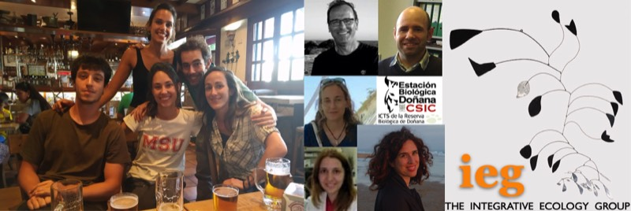
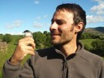
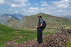
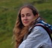
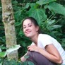
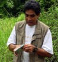

## Pedro Jordano

:::: person-row
{fig-alt="Pedro Jordano"}

::: person-text
[**Pedro Jordano**](pedro.html)

Coevolution of species interactions.
:::
::::

## Post-docs

:::: person-row
{fig-alt="Jorge Isla"}

::: person-text
**Jorge Isla**

\
Seed dispersal by animal frugivores and range expansion in plants: a multilayer
network approach.
:::
::::

:::: person-row
{fig-alt="Dave"}

::: person-text
**Dave**

At the Spaceship USSC Discovery One, to Jupiter.
:::
::::

## Former Post-docs

:::: person-row
{fig-alt="Eva Moracho"}

::: person-text
**Eva Moracho**

\
Cataloguing the Web of Life, a LifeWatch project.
:::
::::

:::: person-row
{fig-alt="Irene Mendoza"}

::: person-text
[**Irene Mendoza**](https://www.researchgate.net/profile/Irene_Mendoza2)

Phenological responses of species interactions to climate change.
:::
::::

:::: person-row
{fig-alt="Lissieux Fuzessy"}

::: person-text
[**Lissieux Fuzessy**](https://www.researchgate.net/profile/Lisieux_Fuzessy)

Ecology of seed dispersal mutualisms by primates.
:::
::::

:::: person-row
{fig-alt="Miguel Jácome"}

::: person-text
[**Miguel Jácome**](https://www.researchgate.net/profile/Miguel_Jacome-Flores)

Context-dependency and multiplexed plant-animal interaction networks.
:::
::::

:::: person-row
{fig-alt="Ana Benítez"}

::: person-text
[**Ana
Benítez**](https://www.ru.nl/environmentalscience/staff/individual-staff/benitez-lopez/)

Species distribution models, spatial ecology, species-habitat relationships,
movement ecology, habitat selection and niche partitioning in co-occurring
species..
:::
::::

:::: {.person-row .nophoto}
::: person-text
[**Elena Valdés-Correcher**](people.html)

Plant-animal interactions: herbivory. Plant chemical ecology.
:::
::::

:::: person-row
{fig-alt="Francisco Rodríguez Sánchez"}

::: person-text
[**Francisco Rodríguez Sánchez**](https://frodriguezsanchez.net) [**MAYBE
Lab**](https://computationalecology.github.io)

Climate change and the population and community ecology of forests.\
Quantitative ecology and data analysis.
:::
::::

:::: person-row
{fig-alt="Alfredo Valido"}

::: person-text
[**Alfredo
Valido**](https://scholar.google.es/citations?user=vMemrEEAAAAJ&hl=en)

Plant-animal interactions on islands.
:::
::::

:::: person-row
{fig-alt="Carine Emer"}

::: person-text
[**Carine Emer**](https://www.researchgate.net/profile/Carine_Emer)

Defaunation and plant-animal interaction networks.
:::
::::

:::: person-row
{fig-alt="Juan Pe González-Varo"}

::: person-text
[**Juan Pe González-Varo**](https://sites.google.com/site/juanpeweb/)

Effects of anthropogenic landscape changes on biodiversity.
:::
::::

:::: person-row
{fig-alt="Marcial Escudero"}

::: person-text
[**Marcial Escudero**](https://sites.google.com/site/amesclir/)

\
Evolution and diversification of flowering plants with special emphasis in genus
*Carex* (Cyperaceae).
:::
::::

:::: {.person-row .nophoto}
::: person-text
**Pablo Villalva**

Field technician.
:::
::::

:::: {.person-row .nophoto}
::: person-text
**Pablo Homet**

Lab and field technician.
:::
::::

:::: person-row
{fig-alt="Arndt Hampe"}

::: person-text
**Arndt Hampe**

Seed dispersal, phylogeography, global change.
:::
::::

:::: person-row
{fig-alt="Kimberly Holbrook"}

::: person-text
[**Kimberly Holbrook**](http://ieg.ebd.csic.es/KimberlyHolbrook/Holbrook.htm)

Seed dispersal and gene flow mediated by large frugivores in tropical habitats.
:::
::::

:::: person-row
{fig-alt="Jerôme Duminil"}

::: person-text
[**Jerôme Duminil**](http://ebe.ulb.ac.be/ebe/Duminil.html)

Population genetics of forest trees.
:::
::::

:::: {.person-row .nophoto}
::: person-text
[**Fabrice
Sagnard**](https://www.google.es/url?sa=t&rct=j&q=&esrc=s&source=web&cd=2&cad=rja&uact=8&ved=0CCkQFjABahUKEwjDx4eRjpLGAhVEPxQKHXDKAD8&url=http%3A%2F%2F65.54.113.26%2FAuthor%2F24217766%2Ffabrice-sagnard&ei=F_x-VYPgL8T-UPCUg_gD&usg=AFQjCNEyVYtNjwPAaIVd6We7q9dZhm1JEA&bvm=bv.95515949,d.d24)

Spatial patterns and genetics of forest trees.
:::
::::

## Technicians

:::: person-row
{fig-alt="JuanMi Arroyo"}

::: person-text
**JuanMi Arroyo**

Lab technician.
:::
::::

:::: person-row
{fig-alt="Cristina Rigueiro"}

::: person-text
**Cristina Rigueiro**

Lab technician.
:::
::::

:::: person-row
{fig-alt="Gemma Calvo"}

::: person-text
**Gemma Calvo**

Lab technician.
:::
::::

:::: person-row
{fig-alt="HAL9000"}

::: person-text
**HAL9000**

"The component is correctly installed and fully operational".
:::
::::

:::: person-row
{fig-alt="Manolo Carrión"}

::: person-text
**Manolo Carrión**

Field and lab technician.
:::
::::

:::: {.person-row .nophoto}
::: person-text
**Rafael Gutiérrez**, former Technician.
:::
::::

:::: {.person-row .nophoto}
::: person-text
**Jesús G.P. Rodríguez**, former Technician.
:::
::::

## Pre-doctoral students

:::: {.person-row .nophoto}
::: person-text
**Si Qi**

Complex plant-herbivore interaction networks in fragmented landscapes.\
Co-supervised with Xingfeng Si and Ding Ping. East China Normal University,
China.
:::
::::

:::: {.person-row .nophoto}
::: person-text
**Flávia Zagury**

\
Plant-frugivore interactions: mutualistic-antagonistic gradients and their
demographic conseuquences.\
Co-supervised with Rita Portela. Universidade Federal de Rio de Janeiro, Brazil.
:::
::::

## Past PhD students

:::: person-row
{fig-alt="Blanca Arroyo"}

::: person-text
**Blanca Arroyo**

\
Plant-pollinator interactions: from individual-based networks to complex webs of
interactions.\
Co-supervised with Ignasi Bartomeus.
:::
::::

:::: person-row
{fig-alt="Elena Quintero"}

::: person-text
**Elena Quintero**

Super-generalist species in complex networks: interaction forms and their
implications in ecosystems.
:::
::::

:::: person-row
{fig-alt="Jorge Isla"}

::: person-text
**Jorge Isla**

\
Seed dispersal by animal frugivores and range expansion in plants: a multilayer
network approach.
:::
::::

:::: person-row
{fig-alt="Caio Ballarin"}

::: person-text
**Caio Ballarin**

Plant-pollinator interaction networks in cerrado vegetation: from interaction
motifs to multilayer structures.\
External supervisor; Co-supervised with Felipe W. Amorim.
:::
::::

:::: person-row
{fig-alt="Carolina Carvalho"}

::: person-text
**Carolina Carvalho**

Ecological and genetic effects of seed size variation in defaunated landscapes.\
Co-supervised with M. Galetti.
:::
::::

:::: person-row
{fig-alt="Eva Moracho"}

::: person-text
**Eva Moracho**

\
Persisting in the limit.Gene flow, reproduction and conservation *Quercus robur*
L. relict populations.\
Co-supervised with A. Hampe.
:::
::::

:::: person-row
{fig-alt="Néstor Pérez Méndez"}

::: person-text
[**Néstor Pérez Méndez**](http://nperezmendez.weebly.com/)

\
Lizard-mediated seed dispersal and gene flow patterns in *Neochamaelea
pulverulenta*, a Canary Islands paleoendemism.\
Co-supervised with A. Valido.
:::
::::

:::: person-row
{fig-alt="Rocío Rodríguez"}

::: person-text
**Rocío Rodríguez**

Seed dispersal, gene flow, and connectivity in fragmented relict tree
populations.\
Co-supervised with A. Hampe.
:::
::::

:::: person-row
{fig-alt="Cristina García"}

::: person-text
[**Cristina García**](http://cristinagarcia.eu/Site/Home.html)

\
Gene flow mediated by frugivores and pollinators.
:::
::::

:::: person-row
{fig-alt="Miranda"}

::: person-text
**MirandaSinnott-Armstrong**\
The evolution of fruit color.\
External co-supervision with Michael Donohue, Yale University, USA.
:::
::::

:::: person-row
{fig-alt="Candelaria"}

::: person-text
**Candelaria Rodríguez**\
The evolution of bird pollination on islands.\
Co-supervised with A. Valido.
:::
::::

:::: person-row
{fig-alt="Francisco Fontúrbel"}

::: person-text
**Francisco Fontúrbel**

Arquitectos ambientales y ecológicos: Pautas para la gestión ambiental del
bosque templado lluvioso de Chile derivadas de la conservación del monito del
monte (*Dromiciops gliroides*).\
External supervisor; Co-supervised with Rodrigo Medel.
:::
::::

:::: person-row
{fig-alt="Jofre Carnicer"}

::: person-text
[**Jofre Carnicer**](http://www.creaf.cat/es/personal/jofre-carnicer)

Macroecology.
:::
::::

:::: person-row
{fig-alt="Débora Rother"}

::: person-text
[**Débora Rother**](http://deborarother.wix.com/deborarother)

Frugivory and seed dispersal limitation in the Atlantic rainforest.\
Co-supervised with M.A. Pizo and R. Rodrigues.
:::
::::

:::: person-row
{fig-alt="Paulo R. Guimarães Jr."}

::: person-text
[**Paulo R. Guimarães Jr.**](http://www.guimaraes.bio.br/)

Ecological networks.
:::
::::

:::: person-row
{fig-alt="Juan Luis García-Castaño"}

::: person-text
**Juan Luis García-Castaño**

Plant-frugivore interactions, seed dispersal and regeneration of montane
vegetation.
:::
::::

:::: person-row
{fig-alt="Fernando González"}

::: person-text
**Fernando González**

Frug**i**voría y ecología de la dispersión de semillas por el pavón *Oreophasis
derbianus* (Cracidae).\
External supervisor.
:::
::::

:::: person-row
{fig-alt="Francisco Rodríguez Sánchez"}

::: person-text
[**Francisco Rodríguez
Sánchez**](https://sites.google.com/site/rodriguezsanchezf/)

An integrative framework to investigate species responses to climate change:
biogeography and ecology of relict trees in the Mediterranean.
:::
::::

:::: person-row
{fig-alt="Alfredo Valido"}

::: person-text
**Alfredo Valido**

Plant-frugivore interactions, and seed dispersal in island habitats.
:::
::::

:::: person-row
{fig-alt="Arndt Hampe"}

::: person-text
**Arndt Hampe**

Cómo ser un relicto en el Mediterráneo: ecología de la reproducción y de la
regeneración de Frangula alnus subsp. baetica..
:::
::::

:::: {.person-row .nophoto}
::: person-text
**Margarita Cobo**

Polinización y biología de la reproducción de plantas Mediterráneas de montaña
:::
::::

:::: {.person-row .nophoto}
::: person-text
**Luis Domínguez**

Ecología y biología de la reproducción de la Grajilla, *Corvus monedula*.
:::
::::

:::: {.person-row .nophoto}
::: person-text
**Manuel Nogales**

Ecología y biología de la reproducción del Cuervo, *Corvus corax*, en Islas
Canarias.
:::
::::

## Master students (current and past)

Miguel Moreno (MJF, PJ)\
Manuel Sánchez (IM, PJ)\
María Campo (IM, AB, PJ)\
Iago Ferreira (AB, JI, PJ)\
Begoña Carrasco (PJ)\
Blanca Arroyo (PJ)\
Miguel Álvarez (JPGV)\
Lucía Bernardos (AV)\
Virginia Oliva (FR)\
Javier Valverde (PJ)\
Yurena Arjona (AV)\
Ana Delgado (AH)\
Zebensui Morales (AV)\
Pilar Mª Pérez (AV)\
Angela Sánchez-Miranda (AH)\
Marina Fleury (PJ)\
Eva Moracho (PJ)\
Elena Quintero (PJ)\
Daniel Pareja (PJ)

--------------------------------------------------------------------------------

####