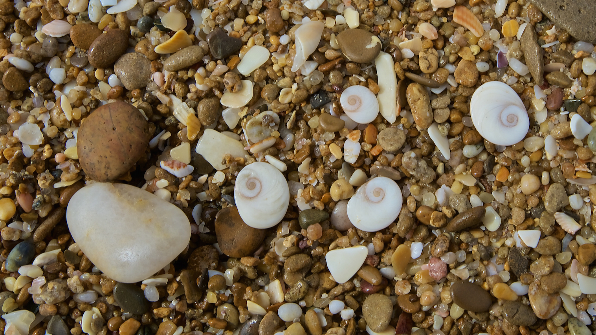
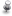

{fig-align="center"}

#### Upcoming Talks

Talk: Upcoming.

--------------------------------------------------------------------------------

### Courses

   [Master en Biodiversidad y Biología de
la
Conservación.](https://biologia.us.es/es/estudios/master-universitario-en-biologia-avanzada-investigacion-y-aplicacion)
Universidad de Sevilla, Sevilla, 2025-2026.

   [Master en Biodiversidad y Biología de
la
Conservación.](http://www.upo.es/postgrado/Master-Oficial-Biodiversidad-y-Biologia-de-la-Conservacion)
13ª edición. Universidad Pablo de Olavide, Sevilla, 2024-2025.

  [16th Latin American Course on Frugivory
and Seed Dispersal September
2027](http://www.rc.unesp.br/ib/ecologia/eco2011/cursofrugivoria/index.php).

  [Curso de Posgraduação em Ecologia e
Biodiversidade](http://www.rc.unesp.br/ib/ecologia/posbiodiversidade/index.php).
A recently launched PhD course at UNESP, Brazil, where PJ participates as
professor. Started August, 2013.

“Frugivoria e dispersão de sementes”, May 2014.\
“Ecologia dos mutualismos animal-planta”, August 2013.\
“Frugivoria e dispersão de sementes-Introdução”, December 2013.

  Curso “Análisis estadístico con R”.
Estación Biológica de Doñana, CSIC. Sevilla, Julio 2011.

  [Plant Ecology and Evolution](#0)
Seminars 1994-2007 (Titles and abstracts)

  [Biogeografía y
evolución](http://ebd10.ebd.csic.es/evol/cursobioevo.html) 2001-2005

  [Téc. moleculares en
ecología](http://ebd10.ebd.csic.es/evol/tecmol.html)

--------------------------------------------------------------------------------

### Previous talks

### 2025

Conference at East China Normal University, Dept. Ecology. Shanghai, China.
"Frugivores, seeds and genes: molecular signatures of plant-animal
interactions". November 3rd, 2025.

Plenary talk at Zhejiang Ecological Society Annual Meeting. Zhejiang, China.
"Cryptic disruptions of seed dispersal processes in the Anthropocene". October
30th, 2025.

Plenary conference for the International Congress of Zoology, ISZS, Beijing,
China. "Animals in plants’ lives: The key elements of their mutualistic
interactions". October 26th, 2025.

Invited talk at the XXIX Congreso Brasileiro de Ornitologia, Santa Teresa, ES,
Brazil. "Medindo a dispersão de sementes por aves: novas técnicas e desafios".
October 2nd, 2025. Em português.

Plenary talk at the XXIX Congreso Brasileiro de Ornitologia, Santa Teresa, ES,
Brazil. "Aves e frutos: a história natural de uma interação mutualista". October
2nd, 2025. Em português.

Conference for the cycle Charles Darwin Seminars at CBioClima, UNESP. Rio Claro,
Brazil. "Cryptic disruptions of seed dispersal processes in the Anthropocene".
September 26th, 2025. Em português.

Conference:"Cryptic disruptions of seed dispersal processes in the
Anthropocene". Universidade Federal de Rio de Janeiro, RJ, Brazil. June 12,
2025. Em português.

Conference for the "Ágora para la Ciencia"
[cycle](http://cedros.edaddeplata.org/docactos/7891/Calendario_-_Invitacion/Calendario_-_Invitacion07891001.pdf)
at the [Residencia de Estudiantes (CSIC)](https://www.residencia.csic.es),
Madrid.\
March 17th, 2025. In Spanish. [Video here
(spanish)](http://www.edaddeplata.org/edaddeplata/Actividades/actos/visualizador.jsp?tipo=2&orden=0&acto=7891).

--------------------------------------------------------------------------------

### 2024

Plenary conference for the opening of the academic course at the Andalusian
Institute of Academies, Spain. Antequera, Málaga. November 23th, 2024. In
Spanish.

Induction speech at the Royal Academy of Sciences, Spain. October 30th, 2024.
[Video here
(Spanish)](https://www.youtube.com/watch?app=desktop&v=vFC-4pSifmM&t=1248s).

Opening Plenary Talk. Title: "The biodiversity of plant-frugivore interactions:
types, functions, and consequences of their extinctions". VIII Frugivory and
Seed Dispersal International Symposium 2024. Ilhéus, Brazil 4-8 August 2024.

Title: Cryptic disruptions of seed dispersal processes in the Anthropocene.
Invited Plenary Talk. International Botanical Congress, Madrid, Spain. July 22,
2024.

La Biodiversidad de las interacciones ecológicas: Retos para documentar la red
de la Vida. Invited conference to celebrate the 25th Anniversariy - Grado de
Ciencias Ambientales, Universidad de Castilla-La Mancha. Toledo, 8 June 2024.

Global change and longevity. Japan-Spain Summit:\
Longevidad y Sociedades longevas\
Salamanca, 25-26 April 2024. CENIE and Fundación Univ. Salamanca.

Closing conference for the MEMORIAL PEREGRÍ CASANOVA DE BIODIVERSITAT I BIOLOGIA
EVOLUTIVA seminar series. Inst. Cavanilles de Biodiversidad, Universidad de
Valencia. Valencia, Spain. 28 February 2024.

Invited conference, Xishuangbanna Tropical Botanical Garden (XTBG) of the
Chinese Academy of Sciences, China. Cryptic disruptions of seed dispersal
processes in the Anthropocene. 18 January 2024.

--------------------------------------------------------------------------------

### 2023

Invited talk: Las aves en la Red de la Vida. Real Academia Sevillana de
Ciencias, Sevilla, Spain. January 24th, 2023.

--------------------------------------------------------------------------------

### 2022

Fleshy fruits and the passerine Palaearctic-African migration system. Invited
presentation at workshop "CALPE 2022: Palaearctic-African Bird Migration".
Gibraltar Museum and Gibraltar University., Gibraltar, UK. September 21th24th,
2022.

Invited talk: Salud global y crisis de\
la Biodiversidad.\
Jornadas científicas conjuntas de las Reales Academias Nacional de Medicina de
España, Nacional de Farmacia, de Ingeniería y Ciencias Exactas, Físicas y
Naturales de España\
"Cambio climático antropogénico: Una Sola Salud (One Health)". Real Academia de
Ciencias Exactas, Físicas y Naturales, Madrid. January 25-26, 2022.

Access discourse to the Academy: La ciencia de la ecología y el análisis de la
complejidad.\
Real Academia Sevillana de Ciencias, Sevilla, Spain. October 3rd, 2022.

  Inaugural talk: Biodiversidad de las interacciones ecológicas: el “bosque
vacío” y los retos de conservación de ecosistemas funcionales. Máster
Interuniversitario-Fund. González-Bernáldez. Universidad Autónoma de Madrid,
Madrid, Spain. January 14th, 2022.

--------------------------------------------------------------------------------

### 2021

Interacciones de animales frugívoros y plantas en el bosque Mediterráneo. Curso
CCEFC-Vadillo Castril, Cazorla, Spain. November 2021.

Invited talk: El interactoma de la Biodiversidad: cómo las interacciones
ecológicas mantienen la Red de la Vida. Real Academia de Ciencias Exactas,
Físicas y Naturales, Madrid. January 12, 2021.

The Biodiversity of Ecological Interactions: Challenges for recording and
documenting the Web of Life. TDWG Symposium. October 2021.

Biodiversity’s interactome: mapping complex networks of ecological interactions
and their functions. Universidade Federal do Rio Grande do Sul, PPG em Ecologia,
Instituto de Biociências. Porto Alegre, brazil. July 1st, 2021.

Sobre Doñana. Invited class; Dept. Anthropology, University of Sevilla, Sevilla,
Spain. December 13th, 2021.

--------------------------------------------------------------------------------

### 2020

Biodiversity’s interactome: mapping complex networks of ecological interactions
and their functions. Invited talk: Center for Macroecology, Evolution and
Climate. Univ.Copenhagen, Copenhaguen, Denmark- November 10, 2020.

Invited talk: Megafauna en las redes ecológicas: el fantasma de las
interacciones extintas. Asociación Mexicana de Mastozoología, A.C.; XV Congreso
Nacional de Mastozoología. Mexico. Octubre 2020.

Biodiversity conservation challenges in the Anthropocene: preserving the web of
life. University of Liverpool, Liverpool, UK. February 2020.

--------------------------------------------------------------------------------

### 2019

Delving into Biodiversity’s interactome: mapping complex networks of ecological
functions. Invited presentation at workshop "Biodiversity, biomass and function
of Earth's primary producers in a global change scenario". Fundación
GADEA-Ciencia/Fundación Ramón Areces, Madrid, Spain. June 17th & 18h, 2019.

Individual traits and the architecture of multiplex ecological networks. 43th
New Phytologist Symposium "Interaction networks and trait evolution", Zurich 1-4
July 2019.

Invited talk, Universidad de Castilla y la Mancha. "Otra Biodiversidad: las
interacciones biológicas en un mundo cambiante". Toledo, March 5th, 2019.

Invited talk, Universidad Complutense de Madrid. "Los retos de conservación de
la Biodiversidad en el antropoceno". Madrid, January 15th, 2019.

Oral presentation: The architecture of multiplex ecological networks. Organized
symposium at 1st Meeting of the Iberian Ecological Society (SIBECOL) & XIV AEET
Meeting: Ecological networks: addressing the complexity of multi-specific
interactions. 4th-7th February 2019, Barcelona, Spain.

--------------------------------------------------------------------------------

### 2018

Symposium at ESA2018. "Cryptic disruptions of seed dispersal processes in the
Anthropocene". New Orleans, August 2018.

The Seventh Christine Mueller Lecture in Ecology and Environmental Studies.
"Biodiversity’s interactome: functional patterns in multi-specific assemblages
of plant-animal mutualisms"; Dept. Evolutionary Biology and Environmental
Studies, University of Zurich, Switzerland. March 29, 2018.

Postgraduate seminar series. "Megafauna en la Red de la Vida: el fantasma de la
extinción de interacciones ecológicas"; Dept. Biología Vegetal y Ecología,
University of Sevilla, Sevilla. February 22, 2018.

--------------------------------------------------------------------------------

### 2017

Invited closing lecture. "Los retos de conservación de la Biodiversidad en el
Antropoceno"; Seminarios Fronteras de la Ciencia. Instituto de Ecología, UNAM,
Mexico. 1st December 2017.

"Las aves en la Red de la Vida". Invited Plenary Conference, Congreso de la
Sociedad española de Ornitología; November 2, 2017.

"Biodiversity’s interactome: mapping complex networks of ecological interactions
and their functions". Univ. California Santa Cruz, USA; October 18, 2017.

"Delving into Biodiversity’s interactome: mapping complex networks of ecological
functions". Univ. California Berkeley, USA; October 22, 2017.

"The architecture of multiplex ecological networks". SYMPOSIUM: Seeing the
Forest for the Trees: The Possibilities and Challenges of Merging Ecological
Networks Across Interaction Types\
ESA Annual Meeting 2017. Portland, USA; August 6, 2017.

"Megafauna in the Web of Life: the extinction of ecological functions".
Gibraltar Museum, Gibraltar; September 22, 2017.

"Biodiversity’s interactome: mapping complex networks of ecological interactions
and their functions". MEDECOS international congress; February 2, 2017.

--------------------------------------------------------------------------------

####